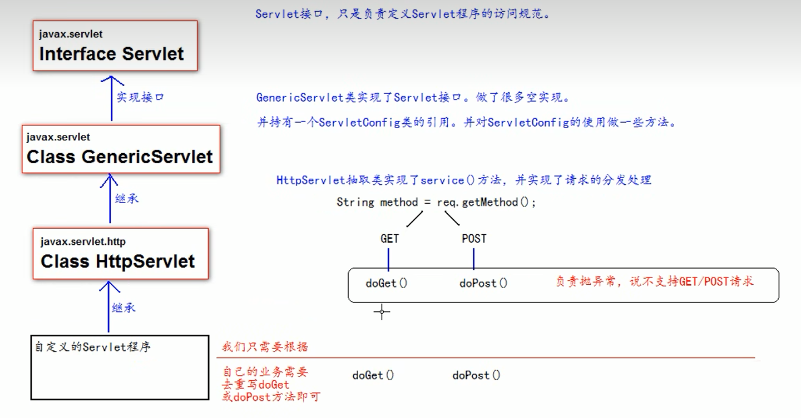
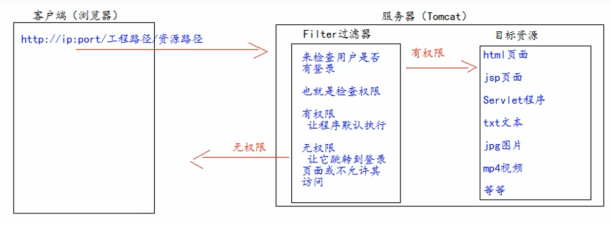

# JavaWeb笔记

## 一 简介

### 1.1 JavaWeb概念

1. 通过Java语言编写的，可以通过浏览器访问的程序
2. JavaWeb是基于请求和响应开发的

### 1.2 Web资源的分类

- **静态资源：**html、css、js、txt、图片、视频
- **动态资源：**jsp页面、servlet程序

### 1.3 常用的服务器

- **Tomcat**
- **Jboss**
- **GlashFish**
- **Resin**
- **WebLogic**

## 二、Servlet

### 2.1 Servlet技术

1. Servlet是JavaEE规范之一，就是**接口**
2. Servlet是运行在服务器上的java小程序，可以接收客户端发送过来的请求，并响应数据给客户端

### 2.2 第一个Servlet程序

1. 编写一个类去实现Servlet接口

2. 实现service方法

3. 到web.xml配置Servlet的地址

   ```xml
   <?xml version="1.0" encoding="UTF-8"?>
   <web-app xmlns="http://xmlns.jcp.org/xml/ns/javaee"
            xmlns:xsi="http://www.w3.org/2001/XMLSchema-instance"
            xsi:schemaLocation="http://xmlns.jcp.org/xml/ns/javaee http://xmlns.jcp.org/xml/ns/javaee/web-app_4_0.xsd"
            version="4.0">
     <!--属于整个Web工程-->
     <context-param>
       <param-name>username</param-name>
       <param-value>yanmingkui</param-value>
     </context-param>
     <context-param>
       <param-name>password</param-name>
       <param-value>123456</param-value>
     </context-param>
   
     <servlet>
       <!--给servlet标签起个别名 一般是类名-->
       <servlet-name>HelloServlet</servlet-name>
       <servlet-class>com.example.tcdemo.HelloServlet</servlet-class>
       <!--只能在init()中获取-->
       <init-param>
         <param-name>username</param-name>
         <param-value>jimowo</param-value>
       </init-param>
     </servlet>
     <!--给servlet程序配置访问地址-->
     <servlet-mapping>
     <!--告诉服务器当前配置的地址给哪个程序使用-->
       <servlet-name>HelloServlet</servlet-name>
       <url-pattern>/hello</url-pattern>
     </servlet-mapping>
   
   </web-app>
   ```

### 2.3 Servlet的生命周期

1. 执行 Servlet 构造器方法
2. init 初始化方法
3. service 方法
4. destory 方法

第1、2步只有在第一次创建实例时会调用

service方法每次访问都会调用

### 2.4 Servlet的继承体系



### 2.5 ServletConfig类

servlet程序的配置信息

```java
public interface ServletConfig {
    String getServletName();

    ServletContext getServletContext();
    
    String getInitParameter(String var1);

    Enumeration<String> getInitParameterNames();
}
```

### 2.6 ServletContext类

1. ServletContext是一个域对象，表示Servlet的上下文
2. 一个Web工程只有一个Servlet对象实例
3. 域对象可以像Map一样存取数据
4. 包含的信息：context-param、当前工程的路径、工程部署在硬盘的绝对路径

### 2.7 区分Get请求和Post请求

- **Get**
  1. form标签 method=post
  2. a标签
  3. link标签 引入css
  4. script标签 引入js
  5. img标签 引入图片
  6. iframe标签 引入html页面
  7. 在浏览器地址栏中输入地址后敲回车
- **Post**
  1. form标签 method=post

### 2.8 HttpServletRequest类

可以通过HttpServletRequest类获得多有请求的信息

1. getHeader方法获得头
2. getParameter方法获得对应参数
3. getParameterValues获得一个参数的数组

解决POST请求的乱码问题

```java
request.setCharacterEncoding("UTF-8");
```

### 2.9 Servlet请求转发

只能在自己的工程里跳转

```java
@WebServlet(name = "TransServlet1", value = "/TransServlet1")
public class TransServlet1 extends HttpServlet {
    @Override
    protected void doGet(HttpServletRequest request, HttpServletResponse response) throws ServletException, IOException {
        // 获取请求的参数
        String username = request.getParameter("username");
        System.out.println("servlet 1 username: " + username);
        // 给材料盖一个章，传送到transServlet2
        request.setAttribute("key","柜台1的章");
        // 问路 Servlet2 怎么走
        RequestDispatcher requestDispatcher = request.getRequestDispatcher("/TransServlet2");
        requestDispatcher.forward(request, response);
    }
}
```

```java
@WebServlet(name = "TransServlet2", value = "/TransServlet2")
public class TransServlet2 extends HttpServlet {
    @Override
    protected void doGet(HttpServletRequest request, HttpServletResponse response) throws ServletException, IOException {
        // 获取请求的参数
        String username = request.getParameter("username");
        System.out.println("servlet 1 username: " + username);
        // 查看transServlet1的章
        Object key = request.getAttribute("key");
        System.out.println(key);
    }
}
```

### 2.10 HttpServletResponse类

HttpServletRequest表示请求信息，HttpServletResponse表示响应信息

- **两个输出流**

  1. 字节流 getOutputStream() 常用于下载
  2. 字符流 getWriter() 常用于回传字符串

  两个流同时只能使用一个

- **如何向客户端回传数据**

  ```Java
  response.setCharacterEncoding("UTF-8"); // 显示中文 默认编码ISO-8859-1
  response.setContentType("text/html");
  
  // Hello
  out.println("<html><body>");
  out.println("<h1>" + message + "</h1>");
  out.println("</body></html>");
  
  ```

### 2.11 请求重定向

指客户端给服务器发请求，然后服务器让客户端重新定向到新地址

## 三、Filter过滤器

### 3.1 什么是Filter

filter过滤器也是个接口，作用是**拦截请求、过滤响应**

拦截请求的场景有：

1. 权限检查
2. 日记操作
3. 事务管理
4. 。。。

### 3.2 Filter应用

要求：Web工程下，有一个admin目录。这个目录下的资源必须是用户登录后才允许访问



**Filter使用步骤**

1. 编写一个Filter类去实现Filter接口，并实现doFilter()方法

   ```java
   public class AdminFilter implements Filter {
       public void init(FilterConfig config) throws ServletException {
       }
   public void destroy() {
   }
   
   @Override
   public void doFilter(ServletRequest request, ServletResponse response, FilterChain chain) throws ServletException, IOException {
       HttpServletRequest httpServletRequest = (HttpServletRequest) request;
       HttpSession session = httpServletRequest.getSession();
       Object user = session.getAttribute("user");
       // 判读是否登录
       if (user == null) {
           request.getRequestDispatcher("/login.jsp").forward(request, response);
       } else {
           // 让程序继续访问用户的目标资源
           chain.doFilter(request, response);
       }
   }
   }
   ```

2. 配置web.xml

   ```
   <filter>
     <filter-name>AdminFilter</filter-name>
     <filter-class>com.example.tcdemo.AdminFilter</filter-class>
   </filter>
   <filter-mapping>
     <filter-name>AdminFilter</filter-name>
     <url-pattern>/admin/*</url-pattern>
   </filter-mapping>
   ```

### 3.3 Filter的生命周期

- Filter的生命周期包含几个方法：

  1. 构造器方法
  2. init初始化方法
  3. doFilter方法
  4. destory方法

  1、2在创建时就会调用

### 3.4 FilterConfig类

Filter过滤器的配置文件类，Tomcat每次创建Filter的时候，也会同时创建一个FilterConfig类，包含了Filter配置文件的配置信息

1. 获取 Filter 的filter name
2. 获取init parameter
3. 获取Servlet context对象

### 3.5 FilterChain类

- FilterChain.doFilter() 方法的作用

  1. 执行下一个Filter过滤器
  2. 执行目标资源

- **Filter执行顺序**

  在多个Filter过滤器执行的时候，它们的执行顺序是由他们在web.xml中从上到下的配置顺序决定的

### 3.6 Filter的拦截路径

- **精确匹配**

  ```xml
  <url-pattern>target.jsp</url-pattern>
  ```

- **目录匹配**

  ```xml
  <url-pattern>/admin/*</url-pattern>
  ```

  目录下的全部资源

- **后缀名匹配**

  ```xml
  <url-pattern>*.html</url-pattern>
  ```

  匹配所有的html结尾的文件