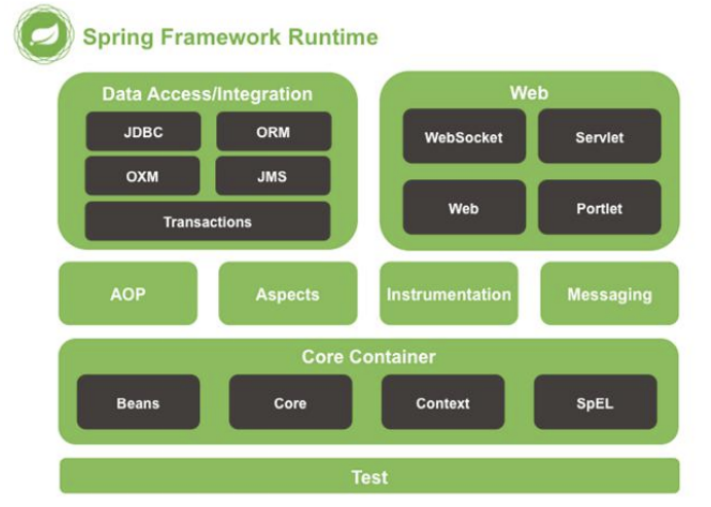

# 朝花夕拾

## Java 面向对象

### 1 父子类的静态初始化代码块、构造代码块、构造方法执行顺序

静态初始化代码块、构造代码块、构造方法 当涉及到继承时，按照如下顺序执行：

1. 执行父类的静态代码块 
2. 执行子类的静态代码块
3. 执行父类的构造代码块
4. 执行父类的构造函数 
5. 执行子类的构造代码块  
6. 执行子类的构造函数

## Java IO

### 1 Java中BufferedReader与Scanner读入的区别

**4.26号华为机考第二题，使用Scanner读入数据一直超时,ORZ**

Java中可以使用BufferedReader和Scanner来进行文件或者输入流的读取操作。二者有以下区别：

1. BufferedReader是基于字符流的，而Scanner即可以基于字符流，也可以基于字节流。
2. BufferedReader比Scanner**更快、更适合读取大量数据**。因为它读取字符时直接将字符存入内存缓冲区，再从内存缓冲区中读取数据。Scanner则需要对输入进行解析，并且其还存在一些缓存和正则表达式等开销，可能会降低性能，同时也会增加代码的复杂度。
3. Scanner可以方便地进行分词等操作，支持各种类型的数据输入，包括int、float、double、boolean、String等。而BufferedReader只能够读取字符串类型的数据，如果需要进行类型转换，需要手动进行。

**读取示例**

请给出两者读取以下数据的示例 第一行代表 接下来要出现的数据的行数 第二行开始每一行第一个数代表 后面出现数的个数 要求将第二行开始的数据存入数组 3 

1 2 

1 3 

1 1

```java
import java.io.BufferedReader;
import java.io.IOException;
import java.io.InputStreamReader;

public class BufferedReaderExample {
    public static void main(String[] args) throws IOException {
        BufferedReader reader = new BufferedReader(new InputStreamReader(System.in));
        int n = Integer.parseInt(reader.readLine());
        
        int[][] nums = new int[n][];
        for (int i = 0; i < n; i++) {
            String[] line = reader.readLine().split(" ");
            int m = Integer.parseInt(line[0]);
            nums[i] = new int[m];
            for (int j = 0; j < m; j++) {
                nums[i][j] = Integer.parseInt(line[j + 1]);
            }
        }
        
        // 输出结果
        for (int i = 0; i < n; i++) {
            for (int j = 0; j < nums[i].length; j++) {
                System.out.print(nums[i][j] + " ");
            }
            System.out.println();
        }
    }
}
// 使用Scanner读取示例：

import java.util.Scanner;

public class ScannerExample {
    public static void main(String[] args) {
        Scanner scanner = new Scanner(System.in);
        int n = scanner.nextInt();
        scanner.nextLine(); // 必须加上，否则下面的读取会有问题
        
        int[][] nums = new int[n][];
        for (int i = 0; i < n; i++) {
            String[] line = scanner.nextLine().split(" ");
            int m = Integer.parseInt(line[0]);
            nums[i] = new int[m];
            for (int j = 0; j < m; j++) {
                nums[i][j] = Integer.parseInt(line[j + 1]);
            }
        }
        
        // 输出结果
        for (int i = 0; i < n; i++) {
            for (int j = 0; j < nums[i].length; j++) {
                System.out.print(nums[i][j] + " ");
            }
            System.out.println();
        }
    }
}
```

## Java多线程

### Java中的原子操作   

1. 除long和double之外的基本类型的赋值操作   
2. 所有引用reference的赋值操作   
3. java.concurrent.Atomic.* 包中所有类的一切操作 

## Spring

### 1 Spring 版本变化

| Version    |                           |
| :--------- | ------------------------- |
| Spring 2.5 | 2007 第一个支持注解的版本 |
| Spring 3.0 | 2009 Java5 为JEE6提供支持 |
| Spring 4.0 | 2013 JAVA8                |
| Spring 5.0 | 支持响应式编程            |

### 2 Spring 的构成



1. Spring 核心容器
   - Spring Core
   - Spring Bean
   - Spring Expression Language
   - Spring Context

### 3 Spring 特色功能

1. 轻量级：代码量轻便
2. IOC：控制反转
3. AOP：面向切面编程可以将应用业务逻辑和系统服务分离
4. 容器：Spring负责创建和管理Bean对象的生命周期和配置
5. MVC：用于配置Web应用，非常方便
6. 事务管理：提供了用于事务管理的通用抽象层
7. JDBC异常：Spring的JDBC抽象层提供了一个异常层次结构，简化了错误处理策略

### 4 使用@Bean注解注入Spring容器和解析xml文件注入有什么区别

使用@Bean注解注入Spring容器和解析XML文件注入的区别如下：

1. 配置方式不同：使用@Bean注解，需要在一个Java配置类中定义Bean；而解析XML文件，则需在Spring XML配置文件中定义Bean。
2. 语法不同：使用@Bean注解时，只需在方法上添加@Bean注解即可，而在XML文件中，则需要使用特定的标签以及属性来定义Bean。
3. 错误检查不同：在使用@Bean注解时，Spring会在应用启动时对Bean进行一些基本的错误检查，例如是否存在循环引用；而在XML文件中定义Bean时，这些错误只能在程序运行时才能被检查出来。
4. 繁琐程度不同：使用@Bean注解时，通常只需要在一个类中添加几个注解即可完成Bean的定义；而在XML文件中定义Bean时，可能需要同时定义多个XML标签，并且需要手动指定Bean之间的关系。

总的来说，使用@Bean注解能够更加方便地定义Bean，并且Spring会在应用启动时自动检查Bean是否正确；而在XML文件中定义Bean虽然更加繁琐，但是也具有灵活性和可读性。实际使用中，可以根据具体情况选择合适的方式来定义Bean。

### 5 Spring IOC的原理

XML解析 + 工厂模式 + 反射机制

- **使用技术：**XML解析、工厂模式、反射

- **工厂模式：**解耦

  ```java
  // UserService.java
  class UserService {
      execute() {
          UserAdd add = UserFactory.getAdd();
      }
  }
  ```

  ```java
  // UserAdd.java
  class UserAdd {
      add() {
          // todo
      }
  }
  ```

  ```java
  // UserFactory.java
  class UserFactory {
  	public static UserAdd getAdd() {
          return new UserAdd();
      }
  }
  ```

- **IOC 的过程**

  1. 配置 XML 文件

     ```xml
     <?xml version="1.0" encoding="UTF-8"?>
     <beans xmlns="http://www.springframework.org/schema/beans"
            xmlns:xsi="http://www.w3.org/2001/XMLSchema-instance"
            xsi:schemaLocation="http://www.springframework.org/schema/beans http://www.springframework.org/schema/beans/spring-beans.xsd">
       <!--配置 User 对象创建-->
       <bean id="user" class="com.ymk.learnSpring.User"></bean>
     </beans>
     ```

  2. 创建工厂类

     ```java
     // UserFactory.java
     class UserFactory {
     	public static UserAdd getAdd() {
             String classValue = class属性值; // xml解析得到对象名
             Class clazz = Class.forName(classValue); // 通过反射创建对象
             return (UserAdd)clazz.newInstance();
         }
     }
     ```

### 6 Spring的配置方式

1. 基于XML的配置：通过XML文件配置应用程序上下文（Application Context），定义bean之间的关系，指定属性来装配bean之间的依赖关系。
2. 基于注解的配置：使用注解来简化配置，允许通过添加注解来自动装配bean之间的依赖关系。注解配置包括@Service、@Component、@Repository、@Controller等。
3. 基于Java的配置：使用基于Java的编程模式来配置Spring应用程序上下文。通过调用@Configuration类中的@Bean方法声明bean并指定依赖关系。

### 7 Spring支持哪几种bean scope（bean的作用域）

"Bean scope"指的是Spring中定义**bean的作用域**。它定义了bean的生命周期和可见范围，在系统运行时决定Spring容器如何创建和管理bean实例。

Spring中最常用的bean scopes有：

- **singleton**：默认值，表示在整个应用程序上下文中只存在一个共享的bean实例。
- **prototype**：表示每次调用时都会创建一个新的bean实例。
- **request**：表示每个HTTP请求都将创建一个新的bean实例，该bean仅在当前请求的范围内可见。
- **session**：表示每个HTTP会话都将创建一个新的bean实例，该bean仅在当前会话的范围内可见。
- **global-session**：类似于标准的 HTTP Session 作用域，不过它仅仅在基于portlet 的 web 应用中才有意义。

### 8 Spring bean的生命周期

1. 通过构造器创建 bean 实例（无参数构造）
2. 为 bean 的属性设置值和对其他 bean 的引用（调用 set 方法）
3. （可选）bean 前置处理器
4. 调用 bean 的初始化方法（需要自己配置初始化方法）
5. （可选）bean 后置处理器
6. bean 可以使用了（对象已经获取到了）
7. 当容器关闭时，调用 bean 销毁的方法（需要自己配置销毁的方法）

### 9 什么叫Spring的内部Bean

只有将 bean 用作另一个 bean 的属性时，才能将 bean 声明为内部 bean。

```xml
<bean id=“StudentBean" class="com.edureka.Student">
	<property name="person">
		<!--This is inner bean -->
		<bean class="com.edureka.Person">
		<property name="name" value="Scott"></property>
		<property name="address" value= "Bangalore"></property>
		</bean>
	</property>
</bean>
```

### 10 Spring有哪些自动装配方式

Spring中实现自动装配的方式有两种：

1. XML配置文件
2. 注解

其中，XML配置文件的实现方式在XML文件中使用\<bean\>等标签手动指定依赖关系；而注解的实现方式则是使用各种注解，如@Autowired、@Resource等，在Java类中指定和注入依赖。需要注意的是，使用注解进行自动装配时需要在配置类中使用@ComponentScan或@EnableAutoConfiguration等注解来开启自动扫描和自动装配的功能。

### 11 @Component, @Controller, @Repository @Service 有何区别？

1. 用途不同

- @Component：通用注解，表示一个受Spring容器管理的组件。
- @Controller：主要用于标识Spring MVC中的控制器组件。
- @Repository：主要用于标识数据访问组件，例如**DAO层**。
- @Service：主要用于标识服务层组件，即**业务逻辑层**。

1. 角色不同

- @Component和@Service和@Repository注解类似，都是注入bean的注解，而@Controller是用于定义控制器，负责完成接收HTTP请求、调用业务逻辑处理模块、返回HTTP响应等工作。

1. 自动扫描时的不同

- Spring在进行组件扫描时，会自动将标注了@Component、@Controller、@Repository和@Service注解的类扫描到Spring容器中，其中@Component是最基础的注解，其他三个注解是@Component的衍生注解。但是在扫描时，Spring会根据注解名称的不同，将它们分配到不同的命名空间中，以便在后续的处理中能够使用更加精确的语义来描述这些组件。

### 12 @Component,@Bean有何区别？

作用对象不同：@Component 注解作用于**类**，而 @Bean 注解作用于**方法**、

@Component 通常是通过路径扫描来自动侦测以及自动装配到 Spring 容器中(我们可以使用 @ComponentScan 注解定义要扫描的路径从中找出标识了需要装配的类自动装配到 Spring 的 bean 容器中)。@Bean 注解通常是我们在标有该注解的方法中定义产生这个 bean，@Bean 告诉了 Spring 这是某个类的实例，当我们需要用它的时候还给我。

**@Bean 注解比 @Component 注解的自定义性更强**，而且很多地方我们只能通过 @Bean 注解来注册 bean。比如当我们引用第三方库中的类需要装配到 Spring 容器时，只能通过 @Bean 来实现。

@Bean 注解使用示例：

```java
@Configuration
public class AppConfig {
    @Bean
	public TransferService transferService() {
		return new TransferServiceImpl();
    }
}
```

@Component 注解使用示例：

```java
@Component
public class ServiceImpl implements AService {
    ....
    )
```

下面这个例子是通过 @Component 无法实现的：

```java
@Bean
public OneService getService(status) {
	case (status)  {
	when 1:
		return new serviceImpl1();
	when 2:
		return new serviceImpl2();
	when 3:
		return new serviceImpl3();
    }
}
```

### 12 @Qualifier 注解有什么用？

当您创建多个相同类型的 bean 并希望仅使用属性装配其中一个 bean 时，您可以使用@Qualifier 注解和 @Autowired 通过指定应该装配哪 个确切的 bean

### 13 AOP底层原理

**AOP 底层使用代理**

1. **有接口情况，使用 JDK 动态代理** 创建一个**接口实现类**代理对象

   JDK 动态代理主要涉及到 java.lang.reflect 包中的两个类：Proxy 和 InvocationHandler。 InvocationHandler是一个接口，通过实现该接口定义横切逻辑，并通过反射机制调用目标类 的代码，动态将横切逻辑和业务逻辑编制在一起。Proxy 利用 InvocationHandler 动态创建 一个符合某一接口的实例，生成目标类的代理对象

2. **没有接口情况，使用 CGLIB 动态代理 **创建当前类**子类**的代理对象

   CGLib 全称为 Code Generation Library，是一个强大的高性能，高质量的代码生成类库， 可以在运行期扩展 Java 类与实现 Java 接口，CGLib 封装了 asm，可以再运行期动态生成新 的 class。和 JDK 动态代理相比较：JDK 创建代理有一个限制，就是只能为接口创建代理实例， 而对于没有通过接口定义业务方法的类，则可以通过 CGLib 创建动态代理

### 14 Spring框架用到了哪些设计模式

1. 工厂模式：BeanFactory就是简单工厂模式的体现，用来创建对象的实例；
2. 单例模式：Bean默认为单例模式。 
3. 代理模式：Spring的AOP功能用到了JDK的动态代理和CGLIB字节码生成技术；
4. 模板方法：用来解决代码重复的问题。比如. RestTemplate, JmsTemplate, JpaTemplate。
5. 观察者模式：定义对象键一种一对多的依赖关系，当一个对象的状态发生改变时，所有依赖于它的对象都会得到通知被制动更新，如 Spring中listener的实现--ApplicationListener 


## SpringMVC

### 1 SpringMVC是什么

springMVC是一个MVC的开源框架，springMVC=struts2+spring，springMVC就相当于是Struts2加上spring的整合

### 2 SpringMVC流程

1. 用户发送请求至前端控制器DispatcherServlet。
2. DispatcherServlet收到请求调用HandlerMapping处理器映射器。
3. 处理器映射器找到具体的处理器(可以根据xml配置、注解进行查找)，生成处理器对象及处理器拦截器(如果有则生成)一并返回给 DispatcherServlet。
4. DispatcherServlet调用HandlerAdapter处理器适配器。
5. HandlerAdapter经过适配调用具体的处理器(Controller，也叫后端控制器)。
6. Controller执行完成返回ModelAndView。
7. HandlerAdapter将controller执行结果ModelAndView返回给DispatcherServlet。
8. DispatcherServlet将ModelAndView传给ViewReslover视图解析器。
9. ViewReslover解析后返回具体View。
10. DispatcherServlet根据View进行渲染视图（即将模型数据填充至视图中）。
11. DispatcherServlet响应用户。


组件： 

1、**前端控制器DispatcherServlet**（不需要工程师开发）,由框架提供 作用：接收请求，响应结果，相当于转发器，中央处理器。有了dispatcherServlet减少了其它组件之间的耦合度。 用户请求到达前端控制器，它就相当于mvc模式中的c，dispatcherServlet是整个流程控制的中心，由它调用其它组件处理用户的请求， dispatcherServlet的存在降低了组件之间的耦合性。 

2、**处理器映射器HandlerMapping**(不需要工程师开发),由框架提供 作用：根据请求的url查找Handler HandlerMapping负责根据用户请求找到Handler即处理器，springmvc提供了不同的映射器实现不同的映射方式，例如：配置文件方式， 实现接口方式，注解方式等。 

3、**处理器适配器HandlerAdapter** 作用：按照特定规则（HandlerAdapter要求的规则）去执行Handler 通过HandlerAdapter对处理器进行执行，这是适配器模式的应用，通过扩展适配器可以对更多类型的处理器进行执行。 

4、**处理器Handler**(需要工程师开发) 注意：编写Handler时按照HandlerAdapter的要求去做，这样适配器才可以去正确执行Handler Handler 是继DispatcherServlet前端控制器的后端控制器，在DispatcherServlet的控制下Handler对具体的用户请求进行处理。 由于Handler涉及到具体的用户业务请求，所以一般情况需要工程师根据业务需求开发Handler。 

5、**视图解析器View resolver**(不需要工程师开发),由框架提供 作用：进行视图解析，根据逻辑视图名解析成真正的视图（view） View Resolver负责将处理结果生成View视图，View Resolver首先根据逻辑视图名解析成物理视图名即具体的页面地址，再生成View视图对象，最后对View进行渲染将处理结果通过页面展示给用户。springmvc框架提供了很多的View视图类型，包括：jstlView、 freemarkerView、pdfView等。一般情况下需要通过页面标签或页面模版技术将模型数据通过页面展示给用户，需要由工程师根据业务需求 开发具体的页面。 

6、**视图View**(需要工程师开发jsp...) View是一个接口，实现类支持不同的View类型（jsp、freemarker、pdf...）核心架构的具体流程步骤如下： 1、首先用户发送请求——>DispatcherServlet，前端控制器收到请求后自己不进行处理，而是委托给其他的解析器进行处理，作为统一访 问点，进行全局的流程控制

### 3 转发和重定向的区别

- 转发指的是在原始请求的基础上将其转发到其他URL上，接收者看到的还是原始请求的URL。
- 重定向则是将原始请求的响应被替换为一个新的响应，新的响应里包含了一个指向新URL的Location头字段，浏览器会重新发起一个新的请求去获取这个新URL的资源。

### 4 继承 WebMvcConfigurerAdapter 抽象类，常用的重写方法列举几个

```java
/** 解决跨域问题 **/
public void addCorsMappings(CorsRegistry registry) ;
/** 添加拦截器 **/
void addInterceptors(InterceptorRegistry registry);
/** 这里配置视图解析器 **/
void configureViewResolvers(ViewResolverRegistry registry);
/** 配置内容裁决的一些选项 **/
void configureContentNegotiation(ContentNegotiationConfigurer configurer);
/** 视图跳转控制器 **/
void addViewControllers(ViewControllerRegistry registry);
/** 静态资源处理 **/
void addResourceHandlers(ResourceHandlerRegistry registry);
/** 默认静态资源处理器 **/
void configureDefaultServletHandling(DefaultServletHandlerConfigurer configurer);

```

## SpringBoot

### 1 SpringBoot特点

1. 独立运行 

   Spring Boot而且内嵌了各种servlet容器，Tomcat、Jetty等，现在不再需要打成war包部署到容器中，Spring Boot只要打成一个可执行的 jar包就能独立运行，所有的依赖包都在一个jar包内。

2. 简化配置 

   spring-boot-starter-web启动器自动依赖其他组件，简少了maven的配置。 

3. 自动配置 Spring Boot能根据当前类路径下的类、jar包来自动配置bean，如添加一个spring-boot-starter-web启动器就能拥有web的功能，无需其他 配置。

4. 无代码生成和XML配置

   Spring Boot配置过程中无代码生成，也无需XML配置文件就能完成所有配置工作，这一切都是借助于条件注解完成的，这也是Spring4.x的 核心功能之一。 

5. 应用监控

   Spring Boot提供一系列端点可以监控服务及应用，做健康检测

### 2 SpringBoot中的Starters

- **Starters是什么**：

  Starters可以理解为启动器，它包含了一系列可以集成到应用里面的依赖包，你可以一站式集成Spring及其他技术，而不需要到处找示例代 码和依赖包。如你想使用Spring JPA访问数据库，只要加入springboot-starter-data-jpa启动器依赖就能使用了。Starters包含了许多项目中 需要用到的依赖，它们能快速持续的运行，都是一系列得到支持的管理传递性依赖。

- **Starters命名**：

  Spring Boot官方的启动器都是以spring-boot-starter-命名的，代表了一个特定的应用类型。第三方的 启动器不能以spring-boot开头命名，它们都被Spring Boot官方保留。一般一个第三方的应该这样命 名，像mybatis的mybatis-spring-boot-starter。

- **以下是Spring Boot中各个启动器的名称和简要功能列表**：

  | 启动器                                       | 功能描述                                                     |
  | -------------------------------------------- | ------------------------------------------------------------ |
  | `spring-boot-starter`                        | 默认的Starter，包含自动配置，日志记录和YAML支持等。          |
  | `spring-boot-starter-actuator`               | 用于监视和管理配置、指标和其他运行时属性的模块。             |
  | `spring-boot-starter-amqp`                   | 使用AMQP（高级消息队列协议）发送和接收消息的支持。           |
  | `spring-boot-starter-aop`                    | 面向切面编程的依赖库，提供了对Spring AOP和AspectJ的集成支持。 |
  | `spring-boot-starter-artemis`                | 使用Apache Artemis进行消息传递的支持。                       |
  | `spring-boot-starter-batch`                  | Spring Batch批处理框架的支持。                               |
  | `spring-boot-starter-cache`                  | Spring框架缓存抽象层的支持。                                 |
  | `spring-boot-starter-data-elasticsearch`     | 使用Elasticsearch搜索引擎进行索引和搜索文档的支持。          |
  | `spring-boot-starter-data-jdbc`              | 使用JDBC进行数据库访问的支持。                               |
  | `spring-boot-starter-data-jpa`               | 使用Java Persistence API进行数据库访问的支持。               |
  | `spring-boot-starter-data-ldap`              | LDAP（轻型目录访问协议）支持。                               |
  | `spring-boot-starter-data-mongodb`           | MongoDB文档数据库的支持。                                    |
  | `spring-boot-starter-data-neo4j`             | Neo4j图形数据库的支持。                                      |
  | `spring-boot-starter-data-redis`             | Redis键值数据存储的支持。                                    |
  | `spring-boot-starter-data-rest`              | 用于快速创建RESTful Web服务的库，基于Spring Data概念。       |
  | `spring-boot-starter-freemarker`             | 使用FreeMarker模板引擎进行Web视图的支持。                    |
  | `spring-boot-starter-groovy-templates`       | 使用Groovy模板引擎进行Web视图的支持。                        |
  | `spring-boot-starter-hateoas`                | 提供了一些开箱即用的API来实现超媒体驱动的Web服务。           |
  | `spring-boot-starter-integration`            | Spring Integration消息和事件驱动的解决方案的支持。           |
  | `spring-boot-starter-jdbc`                   | 使用JDBC进行数据库访问的支持。                               |
  | `spring-boot-starter-jersey`                 | 使用JAX-RS和Jersey进行RESTful Web服务的支持。                |
  | `spring-boot-starter-jooq`                   | JOOQ（Java对象的SQL查询）的支持。                            |
  | `spring-boot-starter-json`                   | Jackson JSON处理器的支持。                                   |
  | `spring-boot-starter-jsonp`                  | JSONP的支持。                                                |
  | `spring-boot-starter-mail`                   | JavaMail发送电子邮件的支持。                                 |
  | `spring-boot-starter-mustache`               | 使用Mustache模板引擎进行Web视图的支持。                      |
  | `spring-boot-starter-oauth2-client`          | OAuth 2.0客户端的支持。                                      |
  | `spring-boot-starter-oauth2-resource-server` | OAuth 2.0资源服务器的支持。                                  |
  | `spring-boot-starter-quartz`                 | Quartz调度框架的支持。                                       |
  | `spring-boot-starter-security`               | Spring Security的支持，实现Web和方法级别的安全性。           |
  | `spring-boot-starter-test`                   | 用于编写和运行单元测试和集成测试的支持。                     |
  | `spring-boot-starter-thymeleaf`              | 使用Thymeleaf模板引擎进行Web视图的支持。                     |
  | `spring-boot-starter-validation`             | Bean验证API（JSR 303）的支持。                               |
  | `spring-boot-starter-web`                    | 提供了Spring MVC和REST Web服务的支持。                       |
  | `spring-boot-starter-web-services`           | 使用Spring Web服务进行SOAP风格的Web服务的支持。              |

### 3 spring-boot-starter-parent是怎么实现它的功能的

spring-boot-starter-parent是一个特殊的Starter项目，它为我们的应用程序提供默认配置和完整的依赖树，以快速构建Spring Boot项目。它还提供了Maven插件的默认配置，例如maven-failsafe-plugin、maven-jar-plugin、maven-surefire-plugin和maven-war-plugin。该项目提供了一个优秀、稳健的基础，方便我们构建Spring Boot应用程序。

Spring Boot Starter Parent是通过继承pom.xml文件，为Spring Boot应用程序提供默认设置和约定的依赖管理。这些默认设置和约定包括常用的插件及其配置、插件版本、项目结构、构建工具等。当我们使用Spring Boot Starter Parent作为我们Maven项目的父级时，它将自动提供一些默认的依赖关系，这使得编写Spring Boot应用程序变得更加简单快捷。同时，它还提供了Maven插件的默认配置，使得我们无需手动配置大量的插件来构建一个完整的Spring Boot应用程序。此外，Spring Boot Starter Parent还定义了许多属性，可以在我们的pom.xml文件中直接使用，方便我们使用。这些功能可以通过Spring Boot Starter Parent的POM文件中的配置来实现。

### 4 SpringBoot集成Mybatis这类的包 是怎么把Mapper接口注入容器的

- **集成使用Mybatis非常简单**

  1.pom中添加依赖

  2.在mapper接口上添加`@Mapper`注解

- **分析(每一个mapper底层其实是mapper工厂)**

  - **`@MapperScanner`**注解

    导入了MapperScannerRegistrar这个类，这个类实现了Spring提供的`ImportBeanDefinitionRegistrar`接口

    在这个类中，重写的`registerBeanDefinitions()`方法获取了`@MapperScanner`注解的类，判断不为空后，把`MapperScannerConfigurer`的类注册进了spring容器中，再通过Mapper扫描配置类把扫描到的Mapper接口注册为`MapperFactoryBean`，实现了自动化配置。

    每次获取mapper时，其实是通过`MapperFactoryBean`内部的`getObject()`方法获得mapper实例

### 5 @SpringBootApplication 注解中的属性相当于哪几个注解

等价于以默认属性使用 @Configuration，@EnableAutoConfiguration 和 @ComponentScan

## Git

### 1 git fetch和git pull的区别

**git fetch:** 相当于是从远程获取最新版本到本地，不会自动merge

```sh
git fetch origin master
git log -p master..origin/master
git merge origin/master

以上命令的含义：
	首先从远程的origin的master主分支下载最新的版本到origin/master分支上
	然后比较本地的master分支和origin/master分支的差别
	最后进行合并
```

**git pull:** 相当于是从远程获取最新版本并merge到本地

```sh
git pull origin master

上述命令其实相当于git fetch 和 git merge
在实际使用中，git fetch更安全一些
因为在merge前，我们可以查看更新情况，然后再决定是否合并
```

