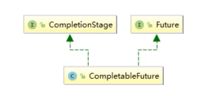

# JUC并发编程

## 1 线程知识

### 1.1 start() 线程开启底层

> 源码分析

```java
public synchronized void start() {
   
    if (threadStatus != 0)
        throw new IllegalThreadStateException();

    group.add(this);

    boolean started = false;
    try {
        start0();	// 调用了start0方法 这个方法在下面展示
        started = true;
    } finally {
        try {
            if (!started) {
                group.threadStartFailed(this);
            }
        } catch (Throwable ignore) {
            
        }
    }
}

// native关键字表示这是一个本地方法
// 底层是jvm中分配了一个线程
private native void start0();
```

### 1.2 基础概念

#### 1.2.1 JUC是什么

JUC是`java.util.concurrent`包的简称，在Java5.0添加，目的就是为了更好的支持高并发任务。让开发者进行多线程编程时减少竞争条件和死锁的问题

#### 1.2.2 java默认有几个线程

两个 main线程 gc线程

java会调用本地方法`private native void start0()`来开启线程，java无法直接操作硬件

#### 1.2.3 并发与并行的区别

- 并发：多线程操作同一个资源，交替执行（CPU一核, 模拟出来多条线程，就像一般的嵌入式操作系统）
- 并行：多个线程同时进行（CPU多核,多个线程同时进行 ; 使用线程池操作）

#### 1.2.4 线程的6个状态

```java
public enum State {
       // 新生
        NEW,
        // 运行
        RUNNABLE,
        // 阻塞
        BLOCKED,
        // 等待
        WAITING,
        //超时等待
        TIMED_WAITING,
        //终止
        TERMINATED;
    }

```

#### 1.2.5 wait和sleep方法的区别

1. wait是Object类的方法，sleep是Thread类的方法
2. wait会释放锁，sleep不会释放锁
3. wait必须在同步代码块中使用，sleep可以在任何地方使用

#### 1.2.6 守护线程

> 用户线程

系统工作线程

> 守护线程

1. 一种特殊的线程，为其他线程服务比如**GC垃圾回收线程**
2. 守护线程作为一个服务线程，当用户线程全部结束了，java虚拟机会自动退出
3. `isDaemon()`方法可以判断该线程是否为守护线程
4. `setDaemon(true)`方法可以将某个线程设置为守护线程

## 2 CompletableFuture

### 2.1 Future接口

> Future接口功能

定义了异步任务执行的一些方法

- 获取异步任务执行的结果
- 取消任务的执行
- 判断任务是否被取消
- 判断任务是否执行完毕

### 2.3 FutureTask类

#### 2.3.1 FutureTask类的继承实现关系

 

#### 2.3.2 FutureTask使用例子

```java
import java.util.concurrent.Callable;
import java.util.concurrent.ExecutionException;
import java.util.concurrent.FutureTask;

public class CallableDemo {

    public static void main(String[] args) throws ExecutionException, InterruptedException {
        FutureTask<Integer> futureTask = new FutureTask<>(new MyThread());
        new Thread(futureTask, "a").start();
        System.out.println(futureTask.get());
    }
}

class MyThread implements Callable<Integer> {

    @Override
    public Integer call() throws Exception {
        System.out.println("call()方法被调用了");
        return 10;
    }
}
```

#### 2.3.3 get方法

> get方法会引起阻塞，可以设置超时时间

```java
import java.util.concurrent.ExecutionException;
import java.util.concurrent.FutureTask;
import java.util.concurrent.TimeUnit;

public class FutureAPIDemo {
    public static void main(String[] args) throws ExecutionException, InterruptedException {

        FutureTask<String> futureTask = new FutureTask<String>( () -> {
            System.out.println(Thread.currentThread().getName() + "\t ----start");
            // 暂停
            try {
                TimeUnit.SECONDS.sleep(5);
            } catch (InterruptedException e) {
                e.printStackTrace();
            }
            return Thread.currentThread().getName() + "\t ----end";
        });

        new Thread(futureTask, "t1").start();
        System.out.println(futureTask.get());   // get方法会引起阻塞
        System.out.println(Thread.currentThread().getName() + "\t ----执行其他任务");
    }
}
```

#### 2.3.4 isDone轮询方法

轮询的方式会耗费无谓的CPU资源，而且也不见得能及时地得到计算机资源

如果想要异步获取结果，通常都会以轮询地方式去获取结果尽量不要阻塞

### 2.4 CompletableFuture优化Future

> **Future接口的缺点**

Future接口对于结果的获取不是很友好，只能通过阻塞或轮询的方式得到任务的结果

>**CompletableFuture的优化方法**

Future中get()方法会阻塞，isDone()方法容易耗费CPU资源

对于真正的异步处理我们希望可以通过传入回调函数，在Future结束时自动调用该函数，这样，我们就不用等待结果。

CompletableFuture提供了一种观察者模式类似的机制，可以让任务执行完成后通知监听的一方

> **CompletableFuture使用场景**

 

### 2.5 CompletableFuture源码分析

#### 2.5.1 CompletableFuture介绍

> **CompletableFuture继承实现关系**

 

- **常用方法**

  #### supplyAsync方法（有返回值）

  ```swift
  //使用默认内置线程池ForkJoinPool.commonPool()，根据supplier构建执行任务
  public static <U> CompletableFuture<U> supplyAsync(Supplier<U> supplier)
  //自定义线程，根据supplier构建执行任务
  public static <U> CompletableFuture<U> supplyAsync(Supplier<U> supplier, Executor executor)
  ```

  #### runAsync方法

  ```java
  //使用默认内置线程池ForkJoinPool.commonPool()，根据runnable构建执行任务
  public static CompletableFuture<Void> runAsync(Runnable runnable) 
  //自定义线程，根据runnable构建执行任务
  public static CompletableFuture<Void> runAsync(Runnable runnable,  Executor executor)
  ```

  上面两个方法如果不指定线程池，则默认使用**ForkJoinPool.commonPool**
  
  > **1.获取结果和触发计算**
  
  #### get方法
  
  阻塞获取结果
  
  ```java
  public T get()
  ```
  
  #### getNow方法
  
  立马获取结果，可以设置默认值，即没有得到真正结果返回的替代值
  
  ```java
  public T getNow(T valueIfAbsent)
  ```
  
  #### complete方法
  
  如果阶段没有运行完，则打断运行过程把value值作为阶段的结果
  
  ```java
  public boolean complete(T value)
  ```
  
  > **2.对计算结果进行处理(有返回值)**
  
  #### thenApply方法（串行化）
  
  计算结果作为输入参数传给下一个阶段
  
  ```java
  public <U> CompletableFuture<U> thenApply(
          Function<? super T,? extends U> fn)
  ```
  
  #### handle方法（串行化）
  
  与`thenApply()`区别，有异常也可以继续执行，根据异常参数进一步处理
  
  ```java
  public <U> CompletableFuture<U> handle(
          BiFunction<? super T, Throwable, ? extends U> fn)
  ```
  
  > **3.对计算结果进行消费(无返回值)**
  
  #### thenAccept方法
  
  消费前一个阶段的计算结果
  
  ```java
  public CompletableFuture<Void> thenAccept(Consumer<? super T> action)
  ```
  
  > **4.执行下一阶段(无参数无返回值)**
  
  #### thenRun方法
  
  ```java
  public CompletableFuture<Void> thenRun(Runnable action)
  ```
  
  > **5.异步方法**
  
  #### thenRunAsync方法
  
  如果不传入自定义线程池，所有阶段都用默认线程池；如果传入自定义线程池，则第一阶段用自定义线程池，之后的then异步阶段传入默认线程池ForkJoinPool（PS：有可能因为系统优化切换原则，使用main线程处理）
  
  ```java
  // 查看源码可以看到 传入了一个异步线程池
  public CompletableFuture<Void> thenRunAsync(Runnable action) {
          return uniRunStage(asyncPool, action);
  }
  // asyncPool的源码
  private static final Executor asyncPool = useCommonPool ?
          ForkJoinPool.commonPool() : new ThreadPerTaskExecutor();
  ```
  
  

#### 2.5.2 CompletionStage分析

> **CompletionStage接口源码**

```java
//依赖单个阶段
public <U> CompletionStage<U> thenApply(Function<? super T,? extends U> fn);     // 默认执行方式
public <U> CompletionStage<U> thenApplyAsync(Function<? super T,? extends U> fn);// 默认的异步执行方式
public <U> CompletionStage<U> thenApplyAsync(Function<? super T,? extends U> fn,Executor executor); //自定义的执行方式

//依赖两个阶段都完成
public <U,V> CompletionStage<V> thenCombine(CompletionStage<? extends U> other, BiFunction<? super T,? super U,? extends V> fn);
public <U,V> CompletionStage<V> thenCombineAsync(CompletionStage<? extends U> other, BiFunction<? super T,? super U,? extends V> fn);
public <U,V> CompletionStage<V> thenCombineAsync(CompletionStage<? extends U> other, BiFunction<? super T,? super U,? extends V> fn, Executor executor);

//依赖两个阶段中的任何一个完成
public <U> CompletionStage<U> applyToEither(CompletionStage<? extends T> other,Function<? super T, U> fn);
public <U> CompletionStage<U> applyToEitherAsync(CompletionStage<? extends T> other,Function<? super T, U> fn);
public <U> CompletionStage<U> applyToEitherAsync(CompletionStage<? extends T> other,Function<? super T, U> fn,Executor executor);
```

> **CompletionStage接口源码demo**

```java
package ymkedu.auc;

import org.junit.jupiter.api.Test;

import java.util.concurrent.*;

public class CompletableFutureDemo {

    // 前一个阶段执行完才能执行下一个阶段
    @Test
    public void thenApply() throws ExecutionException, InterruptedException {
        CompletableFuture<String> stage = CompletableFuture.supplyAsync(() -> "hello")
                .thenApply(s -> s + " world");

        String result = stage.get();
        System.out.println(result);
    }

    // 两个阶段都完成才能输出结果
    @Test
    public void thenCombine() {
        String result = CompletableFuture.supplyAsync(() -> {
            try {
                Thread.sleep(3000);
            } catch (InterruptedException e) {
                e.printStackTrace();
            }
            return "hello";
        }).thenCombine(CompletableFuture.supplyAsync(() -> {
            try {
                Thread.sleep(2000);
            } catch (InterruptedException e) {
                e.printStackTrace();
            }
            return "world";
        }), (s1, s2) -> s1 + " " + s2).join();
        System.out.println(result);
    }

    // 两个阶段谁先完成就输出结果
    @Test
    public void applyToEither() {
        String result = CompletableFuture.supplyAsync(() -> {
            try {
                Thread.sleep(3000);
            } catch (InterruptedException e) {
                e.printStackTrace();
            }
            return "Tom";
        }).applyToEither(CompletableFuture.supplyAsync(() -> {
            try {
                Thread.sleep(1000);
            } catch (InterruptedException e) {
                e.printStackTrace();
            }
            return "John";
        }), s -> "hello " + s).join();
        System.out.println(result);
    }
}
```

> **thenCombine作业**

```java
@Test
    public void thenCombine() {
        String result = CompletableFuture.supplyAsync(() -> {
            try {
                Thread.sleep(3000);
            } catch (InterruptedException e) {
                e.printStackTrace();
            }
            return "hello";
        }).thenCombine(CompletableFuture.supplyAsync(() -> {
            try {
                Thread.sleep(2000);
            } catch (InterruptedException e) {
                e.printStackTrace();
            }
            return "world";
        }), (s1, s2) -> s1 + " " + s2).thenCombine((CompletableFuture.supplyAsync(() -> {
            try {
                Thread.sleep(1000);
            } catch (InterruptedException e) {
                e.printStackTrace();
            }
            return "then combine";
        })), (a, b) -> a + b).join();
        System.out.println(result);
    }
```


#### 2.5.3 CompletableFuture使用例子

```java
import java.util.concurrent.*;

public class CompletableFutureUse {

    public static void main(String[] args) {

        ExecutorService threadPool = Executors.newFixedThreadPool(3);
        try {
            CompletableFuture.supplyAsync(() -> {
                System.out.println(Thread.currentThread().getName() + "----start");
                int res = ThreadLocalRandom.current().nextInt();
                try {
                    TimeUnit.SECONDS.sleep(1);
                } catch (InterruptedException e) {
                    e.printStackTrace();
                }
                return res;
            }, threadPool).whenComplete((v, e) -> {
                if (e == null) {
                    System.out.println("----计算完成 结果为 -> " + v);
                }
            }).exceptionally((e) -> {
                System.out.println("----异常 -> " + e.getMessage());
                return null;
            });
        } finally {
            // 自定义的线程池 记得要关闭
            threadPool.shutdown();
        }

        System.out.println("----main线程");

    }
}
```

### 2.6 函数式编程

#### 2.6.1 函数式接口

> **Runnable接口(无参数无返回值)**

```java
@FunctionalInterface
public interface Runnable {

    public abstract void run();
}
```

>**Function<T, R>**

```java
@FunctionalInterface
public interface Function<T, R> {

    R apply(T t);

    default <V> Function<V, R> compose(Function<? super V, ? extends T> before) {
        Objects.requireNonNull(before);
        return (V v) -> apply(before.apply(v));
    }

    default <V> Function<T, V> andThen(Function<? super R, ? extends V> after) {
        Objects.requireNonNull(after);
        return (T t) -> after.apply(apply(t));
    }

    static <T> Function<T, T> identity() {
        return t -> t;
    }
}

```

>**Consumer\<T\>**

```java
@FunctionalInterface
public interface Consumer<T> {

    void accept(T t);

    default Consumer<T> andThen(Consumer<? super T> after) {
        Objects.requireNonNull(after);
        return (T t) -> { accept(t); after.accept(t); };
    }
}

```

>**Supplier**

```java
@FunctionalInterface
public interface Supplier<T> {

    T get();
}
```

#### 2.6.2 链式编程

> **一个简单的例子**

```java
import lombok.AllArgsConstructor;
import lombok.Data;
import lombok.NoArgsConstructor;
import lombok.experimental.Accessors;

public class CompletableFutureMall {

    public static void main(String[] args) {
        Student student = new Student();
        
        // 传统赋值
        student.setId(1);
        student.setName("ZhangSan");
        student.setMajor("Math");

        // 链式
        student.setId(2).setName("LiSi").setMajor("English");
    }
}

@Data
@NoArgsConstructor
@AllArgsConstructor
@Accessors(chain = true)
class Student {
    private Integer id;
    private String name;
    private String major;
}

```

> **链式编程原理**

返回类型与当前变量类型相同，或者直接返回this

#### 2.6.3 join与get对比

`join()`与`get()`的区别，`join()`不会报异常

```java
import java.util.concurrent.CompletableFuture;

public class CompletableFutureMall {

    public static void main(String[] args) {

        CompletableFuture<String> completableFuture = CompletableFuture.supplyAsync(() -> {
            return "hello";
        });
		// System.out.println(completableFuture.get());
        System.out.println(completableFuture.join());
    }
}
```

### 2.7 例子：电商网站比价

#### 2.7.1 需求

> 1. 同一款产品，同时搜索出各个电商平台的售价
> 2. 同一款产品，同时搜索出在同一个平台的所有卖家的售价
> 3. 输出结果返回一个`List<String>` 

#### 2.7.2 demo

```java
import lombok.*;

import java.util.Arrays;
import java.util.List;
import java.util.concurrent.CompletableFuture;
import java.util.concurrent.ThreadLocalRandom;
import java.util.concurrent.TimeUnit;
import java.util.stream.Collectors;

public class CompletableFutureMall {

    static List<NetMall> netMalls = Arrays.asList(
            new NetMall("jd"),
            new NetMall("taobao"),
            new NetMall("dangdang"),
            new NetMall("pdd")
    );

    public static List<String> getPrice(List<NetMall> netMalls, String productName) {
        return netMalls
                .stream()
                .map(netMall ->
                        String.format(productName + "in %s price is %.2f",
                                netMall.getNetMallName(),
                                netMall.calcPrice(productName)))
                .collect(Collectors.toList());
    }

    public static List<String> getPriceByCompletableFuture(List<NetMall> netMalls, String productName) {
        return netMalls
                .stream()
                .map(netMall -> CompletableFuture.supplyAsync(() ->
                    String.format(productName + "in %s price is %.2f",
                            netMall.getNetMallName(),
                            netMall.calcPrice(productName))))
                .collect(Collectors.toList())
                .stream()
                .map(s -> s.join())
                .collect(Collectors.toList());
    }

    public static void main(String[] args) {

        long startTime = System.currentTimeMillis();

        System.out.println(getPrice(netMalls, "mysql"));

        long endTime = System.currentTimeMillis();
        System.out.println("运行消耗 " + (endTime - startTime) + " 毫秒");

        startTime = System.currentTimeMillis();

        System.out.println(getPriceByCompletableFuture(netMalls, "mysql"));

        endTime = System.currentTimeMillis();

        System.out.println("运行消耗 " + (endTime - startTime) + " 毫秒");

    }
}

@Data
@NoArgsConstructor
@AllArgsConstructor
class NetMall {

    private String netMallName;

    public double calcPrice(String productName) {

        // 假设计算需要1s
        try {
            TimeUnit.SECONDS.sleep(1);
        } catch (InterruptedException e) {
            e.printStackTrace();
        }
        return ThreadLocalRandom.current().nextDouble() * 2 + productName.charAt(0);
    }
}
```

## 3 多线程锁

### 3.1 乐观锁悲观锁

> **悲观锁**

介绍：认为自己在使用数据的时候一定有别的线程来修改数据，因此在获得数据的时候会先加锁，确保数据不会被别的线程修改

使用场景：适合写操作多的场景

例子：synchronized关键字和Lock的实现类都是悲观锁

> **乐观锁**

介绍：认为自己在使用数据的时候**不会**有别的线程来修改数据，不会添加锁

如果这个数据在操作过程中没有更新，则当前线程修改的数据成功写入

如果这个数据被其他线程更新，则根据不同的实现方式执行不同的操作，比如放弃更改，重试抢锁等

使用场景：适合读操作多的场景，

例子：版本号机制Version，CAS算法

### 3.2 传统synchronized

synchronized是Java中的关键字，是一种同步锁。它修饰的对象有以下几种：

     　　1. 修饰一个代码块，被修饰的代码块称为同步语句块，其作用的范围是**大括号{}括起来的代码**，作用的对象是**调用这个代码块的对象**；
     　　2. 修饰一个方法，被修饰的方法称为同步方法，其作用的范围是**整个方法**，作用的对象是**调用这个方法的对象**；
     　　3. 修饰一个静态的方法，其作用的范围是**整个静态方法**，作用的对象是**这个类的所有对象**；
     　　4. 修饰一个类，其作用的范围是**synchronized后面括号括起来的部分**，作用主的对象是**这个类的所有对象**。

### 3.3 Synchronized分析

> **面试题：为什么任何一个对象都可以变成一个锁**

1. 首先，Java中的每个对象都派生自Object类，而每个Java Object在JVM内部都有一个native的C++对象 oop/oopDesc进行对应。

2. 线程在获取锁的时候，实际上就是获得一个监视器对象(monitor) ,monitor可以认为是一个同步对象，所有的Java对象是天生携带monitor。在hotspot源码的 markOop.hpp文件中，可以看到下面这段代码。

   ```cpp
   ObjectMonitor* monitor() const {
   	assert(has_monitor(), "check");
   	return (ObjectMonitor*) (value() ^ monitor_value);
   }
   ```

   多个线程访问同步代码块时，相当于去争抢对象监视器修改对象中的锁标识,上面的代码中ObjectMonitor这个对象和线程争抢锁的逻辑有密切的关系 

### 3.4 Synchronized 和 Lock 的区别

1. Synchronized 内置java关键字，Lock 是一个java类
2. Synchronized 无法判断获取锁的状态
3. Synchronized 会自动释放锁，Lock 必须手动释放锁
4. Synchronized 非公平锁 其他线程会死等
5. Synchronized 适合锁少量的代码同步问题，Lock 适合锁大量的同步代码

### 3.5 公平锁和非公平锁

- **公平锁**

  多个线程按照申请锁的顺序获取锁

- **非公平锁**

  不按照申请锁的顺序获取锁

- **面试题**

  1. 为什么会有公平锁/非公平锁，为什么默认非公平

     恢复挂起的线程到真正锁的获取还是有时间差的，非公平锁能更充分的利用CPU时间片，减少CPU的空闲状态时间

  2. 什么时候用公平锁？什么时候用非公平锁？

     使用多线程很重点的考量点是切换线程的开销，当采用非公平锁时，当一个线程请求获取锁的同步状态，然后释放同步状态，所以刚释放的锁的线程在此刻再次获取同步状态的概率就非常大，减少了线程开销

> **买票小程序Demo**

```java
import java.util.concurrent.locks.Lock;
import java.util.concurrent.locks.ReentrantLock;

public class SaleTicketDemo {
    public static void main(String[] args) {
        Ticket ticket = new Ticket();

        new Thread(() -> {
            for (int i = 0; i < 40; i++) ticket.sale();
        }, "a").start();
        new Thread(() -> {
            for (int i = 0; i < 40; i++) ticket.sale();
        }, "b").start();
        new Thread(() -> {
            for (int i = 0; i < 40; i++) ticket.sale();
        }, "c").start();
    }
}

class Ticket {
    private int ticketNum = 30;
    private Lock lock = new ReentrantLock(true);    // 无参数默认非公平锁

    public void sale() {
        lock.lock();
        try {
            if (this.ticketNum > 0) {
                System.out.println(Thread.currentThread().getName() + "购得第" + (ticketNum--) + "张票，剩余" + ticketNum + "张");
            }
            // 增加错误发生的概率
            Thread.sleep(10);
        } catch (Exception e) {
            e.printStackTrace();
        } finally {
            lock.unlock();
        }
    }
}
```

### 3.6 可重入锁（递归锁）

- **介绍**

  是指同一个线程在外层方法获取锁的时候，再进入该线程的内层方法（同一个锁）会自动获取锁，不会因为外层已经获取的锁没有释放而阻塞。（Synchronized关键字和ReentrantLock都是可重入锁）

- **可重入锁种类**

  1. 隐式锁（Synchronized关键字使用的锁）

     ```java
     public class ReEntryLockDemo {
     
         public static void main(String[] args) {
             final Object o = new Object();
     
             new Thread(() -> {
                 synchronized (o) {
                     System.out.println("1层");
                     synchronized (o) {
                         System.out.println("2层");
                         synchronized (o) {
                             System.out.println("3层");
                         }
                     }
                 }
             }, "thread1").start();
         }
     }
     // 结果
     //1层
     //2层
     //3层
     ```

     

  2. 显式锁（Lock类）

### 3.7 死锁

- **造成死锁的原因**

  1.系统资源不足，比如锁再被占用时

- **检测死锁**

  > 在终端中
  >
  > 1. 线用`jps -l`查找我们需要排查的线程
  > 2. 根据线程号使用`jstack 线程号`来查找死锁

  > 使用jconsole
  >
  > 1. 通过`win+r`打开运行，输入`jconsole`打开java控制台
  > 2. 


## 4 中断机制

### 4.1 线程中断机制

#### 4.1.1 什么是中断机制

首先，一个线程不应该由其他线程来中断或停止，所以`Thread. stop, Thread.suspend, Thread.resume`这些方法都被废弃了

其次，java提供了一个停止线程的协商机制---中断，中断需要程序员自己实现

若要中断一个线程，首先调用`interupt`方法，此时线程中断标志位被置为1，应该在该线程内部实现一个判断`interupted`方法是否已被中断，然后自行了断。

#### 4.1.2 面试题

>**如何停止中断运行中的线程**

```java
import java.util.concurrent.CompletableFuture;
import java.util.concurrent.ExecutorService;
import java.util.concurrent.Executors;
import java.util.concurrent.TimeUnit;

public class InterruptDemo {

    static volatile boolean isStop = false;

    public static void main(String[] args) {

        ExecutorService pool = Executors.newFixedThreadPool(5);

        CompletableFuture<Void> future = CompletableFuture.runAsync(() -> {
            System.out.println(Thread.currentThread().getName() + "----start");
            while (true) {
                if (isStop) {
                    System.out.println(Thread.currentThread().getName() + "结束");
                    break;
                }
                System.out.println("hello volatile");
            }
        }, pool);

        CompletableFuture<Void> future2 = CompletableFuture.runAsync(() -> {
            System.out.println(Thread.currentThread().getName() + "----start");
            // 延迟3秒后 停止上面的线程
            try {
                TimeUnit.SECONDS.sleep(1);
            } catch (InterruptedException e) {
                e.printStackTrace();
            }
            System.out.println(Thread.currentThread().getName() + "申请停止线程");
            isStop = true;
        }, pool);
    }
}
```

```java
import java.util.concurrent.CompletableFuture;
import java.util.concurrent.ExecutorService;
import java.util.concurrent.Executors;
import java.util.concurrent.TimeUnit;
import java.util.concurrent.atomic.AtomicBoolean;

public class InterruptDemo {

    // 使用atomic布尔值同样可以
    static AtomicBoolean aBoolean = new AtomicBoolean(false);

    public static void main(String[] args) {

        ExecutorService pool = Executors.newFixedThreadPool(5);

        CompletableFuture<Void> future = CompletableFuture.runAsync(() -> {
            System.out.println(Thread.currentThread().getName() + "----start");
            while (true) {
                if (aBoolean.get()) {
                    System.out.println(Thread.currentThread().getName() + "结束");
                    break;
                }
                System.out.println("hello atomic");
            }
            return;
        }, pool);

        CompletableFuture<Void> future2 = CompletableFuture.runAsync(() -> {
            System.out.println(Thread.currentThread().getName() + "----start");
            // 延迟3秒后 停止上面的线程
            try {
                TimeUnit.SECONDS.sleep(3);
            } catch (InterruptedException e) {
                e.printStackTrace();
            }
            System.out.println(Thread.currentThread().getName() + "申请停止线程");
            aBoolean.set(true);
            return;
        }, pool);
    }
}
```

```java
import java.util.concurrent.TimeUnit;

public class InterruptDemo {

    public static void main(String[] args) {

        // 判断中断标志位是否置1
        Thread thread = new Thread(() -> {
            System.out.println(Thread.currentThread().getName() + "----start");
            while (true) {
                if (Thread.currentThread().isInterrupted()) {
                    System.out.println(Thread.currentThread().getName() + "结束");
                    break;
                }
                System.out.println("hello atomic");
            }
            return;
        }, "thread1");
        thread.start();

        new Thread(() -> {
            System.out.println(Thread.currentThread().getName() + "----start");
            // 延迟3秒后 停止上面的线程
            try {
                TimeUnit.SECONDS.sleep(3);
            } catch (InterruptedException e) {
                e.printStackTrace();
            }
            System.out.println(Thread.currentThread().getName() + "申请停止线程");
            thread.interrupt();
            return;
        }, "thread2").start();
    }
}
```

## 5 LockSupport

### 5.1 介绍

LockSupport用于创建锁和其他同步类的基本线程阻塞原语，就是对线程等待唤醒机制的优化

`park()`阻塞线程

`unpark()`解除阻塞

### 5.2 等待唤醒线程的三种方法

1. 使用Object中的wait()方法让线程等待，使用Object中的notify()方法唤醒线程

   ```java
   public class LockSupportDemo {
       public static void main(String[] args) {
           Object objectLock = new Object();
   
           new Thread(() -> {
               synchronized (objectLock) {
                   System.out.println(Thread.currentThread().getName() + "\t ----come in");
                   try {
                       objectLock.wait();
                   } catch (InterruptedException e) {
                       e.printStackTrace();
                   }
                   System.out.println(Thread.currentThread().getName() + "\t ----被唤醒");
               }
           }, "t1").start();
   
           new Thread(() -> {
               synchronized (objectLock) {
                   System.out.println(Thread.currentThread().getName() + "\t ----come in");
                   objectLock.notify();
                   System.out.println(Thread.currentThread().getName() + "\t ----发出通知");
               }
           }, "t2").start();
       }
   }
   ```

2. 使用JUC包中的Condition的await()方法让线程等待，使用signal()方法唤醒线程

   ```java
   public class LockSupportDemo {
       public static void main(String[] args) {
   
           Lock lock = new ReentrantLock();
           Condition condition = lock.newCondition();
   
           new Thread(() -> {
               lock.lock();
               System.out.println(Thread.currentThread().getName() + "\t ----come in");
               try {
                   condition.await();
                   System.out.println(Thread.currentThread().getName() + "\t ----被唤醒");
               } catch (InterruptedException e) {
                   e.printStackTrace();
               } finally {
                   lock.unlock();
               }
           }, "t1").start();
   
           new Thread(() -> {
               lock.lock();
               System.out.println(Thread.currentThread().getName() + "\t ----come in");
               try {
                   condition.signal();
                   System.out.println(Thread.currentThread().getName() + "\t ----发出通知");
               } catch (Exception e) {
                   e.printStackTrace();
               } finally {
                   lock.unlock();
               }
           }, "t2").start();
       }
   }
   ```

3. LockSupport类park()和unpark()

   ```java
   public class LockSupportDemo {
       public static void main(String[] args) {
   
           Thread t1 = new Thread(() -> {
               System.out.println(Thread.currentThread().getName() + "\t ----come in");
               LockSupport.park();
               System.out.println(Thread.currentThread().getName() + "\t ----被唤醒");
           }, "t1");
           t1.start();
   
           new Thread(() -> {
               System.out.println(Thread.currentThread().getName() + "\t ----come in");
               LockSupport.unpark(t1);
               System.out.println(Thread.currentThread().getName() + "\t ----发出通知");
           }, "t2").start();
       }
   }
   ```

   **支持先唤醒后等待 **park方法消耗许可证 unpark方法增加凭证 同一时间最多只有一个凭证累加无效

## 6 JAVA内存模型JMM

### 6.1 带着问题学习

1. JMM与Volatile之间的关系

2. JMM有哪些特性和它的三大特征

   原子性、可见性、有序性

3. JMM为什么会出现，作用和功能是什么

   屏蔽各个硬件平台和操作系统的内存访问差异以实现让Java程序在各种平台下都能达到一致的内存访问效果。

4. happens-before先行发生原则

### 6.2 计算机硬件存储体系

CPU在运行时，会首先从内存中取出运算指令，然后解码并确定其类型和操作数，最后执行该指令。在指令执行完毕后，CPU会将计算所得数据写入内存。

然而，在计算机系统中存在一个CPU的运算速度与内存读写速度不匹配的问题，即CPU的运算速度远比内存的读写速度快。由于读写速度缓慢，严重拖累了计算机的运行效率。为了解决这一问题，现代计算机系统在CPU与内存之间加入了一层或多层**高速缓存**，而高速缓存的读写速度与CPU的运算速度几乎相当。在加入高速缓存后，CPU在执行指令前，需要先将要运算的数据从内存读取（即复制）到高速缓存中，接着CPU对数据进行处理，然后再将运算后的数据写入到高速缓存，最后再从缓存同步回内存中。

在多CPU的系统中，每个处理器都有自己的高速缓存，而它们又共享同一个主内存，如下图。当多个处理器的运算任务都涉及到同一块主内存区域时，将可能导致各自缓存数据不一致的问题。例如，处理器1与处理器2都从主内存读取了同一个数据分别存储到自己的高速缓存区域，然后，两个处理器都对这一数据进行了修改。那么再同步回主内存的时候应该以哪条数据为准呢？这一问题就是**缓存一致性问题**。为了解决缓存一致性问题，需要遵循缓存一致性协议。

### 6.3 Java内存模型Java Memory Model

 

### 6.4 JMM规范下 三大特性

#### 6.4.1 可见性

当一个线程修改了某一个共享变量的值，其他线程能够立即知道，JMM规定线程间变量值的传递需要通过主内存来完成。每个线程在自己的工作内存中有个操作变量的副本。

#### 6.4.2 有序性

对于一个线程内代码的执行并不一定是从上到下有序执行，为了提升性能，编译器和处理器会对**指令序列进行重排序**。

**问题**：JVM可一个根据处理器特性对机器指令重排。但是指令重排可一个保证单线程的语义一致，但是多线程间可能产生问题。

**方法**：在重排序时需考虑指令之间的依赖性

### 6.5 JMM规范下 多线程对变量的独写过程

JMM规定所有变量都存储在主内存中，每条线程还有自己的工作内存。线程的工作内存中保存了被线程使用的变量的主内存副本，线程对变量的所有操作都必须在工作内存中进行，而不能直接读写主内存中的数据。不同线程之间也无法直接访问对方的工作内存中的变量，**线程间变量值的传递需要通过主内存来完成**。

### 6.6 JMM规范下 多线程先行发生原则之happens-before

在JMM中，如果一个操作执行的结果需要对另一个操作可见性，或者代码重排序，那么这两个操作之间必须存在happens-before(先行发生)原则。

#### 6.6.1 次序规则

写后读

#### 6.6.2 锁定规则

一个unlock操作先行发生于lock之后

#### 6.6.3 volatile变量规则

对一个volatile变量的写操作先行发生于后面对这个变量的读操作，前面的写对后面的读是可见的

#### 6.6.4 传递规则

如果操作A先行发生于操作B，而操作B又先行发生于操作C，则可以得出操作A先行发生于操作C

#### 6.6.5 线程启动规则

Thread对象的start()方法先行发生于此线程的每一个动作

#### 6.6.6 线程中断规则

先用interupt()方法调用先行发生于interrupted()之前

#### 6.6.7 线程终止规则

线程中的所有操作都先行发生于对此线程的终止检测，isAlive()检测线程是否终止执行

#### 6.6.8 对象终结规则

一个对象的初始化完成(构造函数执行结束)，先行发生于它的finalize()方法的开始

## 7 Volatile与JMM

### 7.1 内存屏障

内存屏障是一类同步屏障指令，是CPU或编译器在对内存随机访问的操作中的一个同步点，使得此点之前的所有独写操作都执行后才可以开始执行此点之后的操作。

Java内存模型的排序规则会要求Java编译器在生成JVM指令时插入特定的内存屏障指令，通过这些内存屏障指令，volatile实现了Java内存模型中的可见性和有序性，但volatile无法保证原子性。

### 7.2 Volatile保证可见性

当两个线程共用一个共享变量时，如果其中一个线程修改了这个共享变量的值。但是由于另外一个线程在自己的工作内存中已经保留了一份该共享变量的副本，因此它无法感知该变量的值已经被修改

```java
public class VolatileDemo {

    private static boolean ready;

    public static class MyThread extends Thread {
        @Override
        public void run() {
            System.out.println("MyThread is running...");
            while (!ready) ; // 如果ready为false，则死循环
            System.out.println("MyThread is end");
        }
    }


    public static void main(String[] args) throws InterruptedException {
        new MyThread().start();
        Thread.sleep(1000);
        ready = true;
        System.out.println("ready = " + ready);
        Thread.sleep(5000);
        System.out.println("main thread is end.");
    }

}

```

> 上面这个例子子线程就感知不到ready的变化，当把ready改为Volatile关键字后就能够感知

### 7.3 Volatile保证有序性

编译器为了优化程序性能，可能会在编译时对字节码指令进行重排序。重排序后的指令在单线程中运行时没有问题的，但是如果在多线程中，重排序后的代码则可能会出现问题。因此，一般在多线程并发情况下我们都应该禁止指令重排序的优化。而volatile关键字就可以禁止编译器对字节码进行重排序。

```java
public class DoubleCheckLock {

    private volatile static DoubleCheckLock instance;

    private DoubleCheckLock(){}

    public static DoubleCheckLock getInstance(){

        //第一次检测
        if (instance==null){
            //同步
            synchronized (DoubleCheckLock.class){
                if (instance == null){
                    //多线程环境下可能会出现问题的地方
                    instance = new DoubleCheckLock();
                }
            }
        }
        return instance;
    }
}


```

> 上面是一个经典的例子 双重校验锁

### 7.4 Volatile不能保证原子性

对于原子操作，volatile关键字是无能为力的。如果需要保证原子操作，则需要使用synchronized关键字、Lock锁 或者Atom相关类来确保操作的原子性。

## 8 CAS机制

### 8.1 CAS是什么 解决了什么问题

- **没有CAS时怎么保证数据的原子性**

  写入共享数据时 加锁保证原子性

- **使用CAS后**

  使用原子类AtomicInteger

- **悲观锁与乐观锁**（阻塞与非阻塞）

  悲观锁认为更新数据时，大概率会有其他线程来争抢，所以第一个获取到资源的线程会将资源锁定起来，即其他没有获取到资源的线程会阻塞。**synchronized就是java中悲观锁的典型实现**

  乐观锁认为不会有线程来争抢，所以更新数据的时候不会对共享数据加锁。但是在正式更新数据之前会检查数据是否被其他线程改变过，如果未被其他线程改变过就将共享变量更新成最新值，如果发现共享变量已经被其他线程更新过了，就重试，直到成功为止。**CAS机制就是乐观锁的典型实现。**

- **CAS是什么**

  compare and swap 比较并交换

  包含三个操作数--内存位置、预期原值、更新值

  执行CAS操作时（写入），将内存位置的值与预期原值比较，如果相匹配，那么处理器会自动将该位置值更新为新值；如果不匹配，处理器不做任何操作，多个线程同时执行CAS操作只有一个会成功

- **CAS底层原理**

  非阻塞原子性操作，通过硬件保证了CAS的原子性。所以效率更高，且更可靠。

  底层为一条CPU原子指令（cmpxchg指令），Java提供的CAS操作类--Unsafe

### 8.2 Unsafe类

CAS核心类，提供操作特定内存数据的方法

调用Unsafe类的CAS方法，JVM会编译出汇编指令，且这是一条CPU原子指令，执行是连续的，不会导致数据不一致问题。

### 8.3 AtomicReference类（对象的原子操作类）

1. AtomicReference和AtomicInteger非常类似，不同之处就在于AtomicInteger是对整数的封装，而AtomicReference则对应普通的对象引用。也就是它可以保证你在修改对象引用时的线程安全性。
2. AtomicReference是作用是对”对象”进行原子操作。 提供了一种读和写都是原子性的对象引用变量。原子意味着多个线程试图改变同一个AtomicReference(例如比较和交换操作)将不会使得AtomicReference处于不一致的状态。

```java
import lombok.AllArgsConstructor;
import lombok.Data;
import org.junit.jupiter.api.Test;

import java.util.concurrent.atomic.AtomicReference;

@AllArgsConstructor
@Data
class User {
    String name;
    int age;
}

public class AtomicDemo {

    @Test
    public void testAtomicReference() {
        AtomicReference<User> atomicReference = new AtomicReference<>();

        User z3 = new User("z3", 22);
        User l4 = new User("l4", 23);

        atomicReference.set(z3);

        System.out.println(atomicReference.compareAndSet(z3, l4));
        System.out.println(atomicReference.get().toString());
    }
}
```

### 8.4 CAS手写自旋锁

```java
/**
 * 实现一个自旋锁：循环获取锁不会阻塞
 * A线程先进来调用lock方法锁5秒钟，B随后进来发现当前线程持有锁，自旋等待
 */
class SpinLockDemo {
    AtomicReference<Thread> atomicReference = new AtomicReference<>();

    public void lock() {
        Thread thread = Thread.currentThread();
        System.out.println(Thread.currentThread().getName() + "\t ----come in");
        while (!atomicReference.compareAndSet(null, thread)) {
        }
        System.out.println(Thread.currentThread().getName() + "\t ----get lock");
    }

    public void unlock() {
        Thread thread = Thread.currentThread();
        atomicReference.compareAndSet(thread, null);
        System.out.println(Thread.currentThread().getName() + "\t ----unlock");
    }
    
    @Test
    public void testSpinLockDemo() {
        SpinLockDemo demo = new SpinLockDemo();

        new Thread(() -> {
            demo.lock();
            try {
                TimeUnit.SECONDS.sleep(5);
            } catch (InterruptedException e) {
                e.printStackTrace();
            }
            demo.unlock();
        }, "A").start();
        try {
            TimeUnit.SECONDS.sleep(1);
        } catch (InterruptedException e) {
            e.printStackTrace();
        }
        new Thread(() -> {
            demo.lock();
            demo.unlock();
        }, "B").start();
        try {
            TimeUnit.SECONDS.sleep(10);
        } catch (InterruptedException e) {
            e.printStackTrace();
        }
    }
}
```

### 8.5 CAS的缺点

**1. ABA问题**
ABA问题：CAS在操作的时候会检查变量的值是否被更改过，如果没有则更新值，但是带来一个问题，最开始的值是A，接着变成B，最后又变成了A。经过检查这个值确实没有修改过，因为最后的值还是A，但是实际上这个值确实已经被修改过了。为了解决这个问题，在每次进行操作的时候加上一个版本号，每次操作的就是两个值，一个版本号和某个值，A——>B——>A问题就变成了1A——>2B——>3A。在jdk中提供了AtomicStampedReference类解决ABA问题，用Pair这个内部类实现，包含两个属性，分别代表版本号和引用，在compareAndSet中先对当前引用进行检查，再对版本号标志进行检查，只有全部相等才更新值。

**2. 可能会消耗较高的CPU**
看起来CAS比锁的效率高，从阻塞机制变成了非阻塞机制，减少了线程之间等待的时间。每个方法不能绝对的比另一个好，在线程之间竞争程度大的时候，如果使用CAS，每次都有很多的线程在竞争，也就是说CAS机制不能更新成功。这种情况下CAS机制会一直重试，这样就会比较耗费CPU。因此可以看出，如果线程之间竞争程度小，使用CAS是一个很好的选择；但是如果竞争很大，使用锁可能是个更好的选择。在并发量非常高的环境中，如果仍然想通过原子类来更新的话，可以使用AtomicLong的替代类：LongAdder。

**3. 不能保证代码块的原子性**
Java中的CAS机制只能保证共享变量操作的原子性，而不能保证代码块的原子性。

### 8.6 缺点改进

1. **改进ABA问题**

   AtomicStampedReference版本号 时间戳

   ```java
   @Data
   @AllArgsConstructor
   class Book {
       private int id;
       private String name;
   }
   
   public class ABADemo {
       public static void main(String[] args) {
           Book jdk = new Book(1, "jdk");
   
           AtomicStampedReference<Book> stampedReference = new AtomicStampedReference<>(jdk, 1);
           System.out.println(stampedReference.getReference() + "\t" + stampedReference.getStamp());
   
           Book mysql = new Book(1, "mysql");
           boolean b = stampedReference.compareAndSet(jdk, mysql, stampedReference.getStamp(), stampedReference.getStamp() + 1);
           System.out.println(b + "\t" + stampedReference.getReference() + "\t" + stampedReference.getStamp());
       }
   }
   ```


## 10 ThreadLocal

### 10.1 问题

1. ThreadLocal中ThreadlocalMap的数据结构和关系?
2. ThreadLocal的key是弱引用，这是为什么?
3. ThreadLocal内存泄露问题你知道吗?
4. ThreadLocal中最后为什么要加remove方法?

### 10.2 ThreadLocal是什么

ThreadLocal提供线程局部变量。这些变量与正常的变量不同，因为每一个线程访问ThreadLocal实例时，都有一个自己的副本（JMM）。

ThreadLocal的目的是希望将状态（用户ID 事务ID）与各自的线程相关联。

### 10.3 API与调用

| 变量和类型                  | 方法                                          | 描述                                         |
| :-------------------------- | :-------------------------------------------- | :------------------------------------------- |
| `T`                         | `get()`                                       | 返回当前线程的此线程局部变量副本中的值。     |
| `protected T`               | `initialValue()`                              | 返回此线程局部变量的当前线程的“初始值”。     |
| `void`                      | `remove()`                                    | 删除此线程局部变量的当前线程值。             |
| `void`                      | `set(T value)`                                | 将此线程局部变量的当前线程副本设置为指定值。 |
| `static <S> ThreadLocal<S>` | `withInitial(Supplier<? extends S> supplier)` | 创建一个线程局部变量。                       |

```java
public static void main(String[] args) {
    ThreadLocal<Integer> threadLocal = new ThreadLocal<>();

    new Thread(() -> {
        threadLocal.set(10);
        try {
            Thread.sleep(1000);
            System.out.println(Thread.currentThread().getName() + " value = " + threadLocal.get());
        } catch (InterruptedException e) {
            e.printStackTrace();
        }
    }).start();

    try {
        Thread.sleep(1000);
        System.out.println(Thread.currentThread().getName() + " value = " + threadLocal.get());
    } catch (InterruptedException e) {
        e.printStackTrace();
    }
}
```

结果

```
Thread-0 value = 10
main value = null
```

可以看到，我们在子线程中通过ThreadLocal存储了一个10，则子线程中可以取到这个值。而主线程中取到的却是null。这意味着通过某个线程通过ThreadLocal存储的数据，只有在这个线程中才能访问的到。

### 10.4 ThreadLocal的实现原理

#### 10.4.1 set方法

```java
public void set(T value) {
    // 获取当前线程
    Thread t = Thread.currentThread();
    // 获取线程中的ThreadLocalMap
    ThreadLocalMap map = getMap(t);
    if (map != null) {
        // 将值存储到ThreadLocalMap中
        map.set(this, value);
    } else {
        // 创建ThreadLocalMap，并存储值
        createMap(t, value);
    }
}
void createMap(Thread t, T firstValue) {
    // 实例化当前线程中的ThreadLocalMap
    t.threadLocals = new ThreadLocalMap(this, firstValue);
}
```

上述代码首先获取到了当前线程，然后从当前线程中获取ThreadLocalMap，**ThreadLocalMap**是一个存储K-V的集合，我们后边分析。如果此时ThreadLocalMap不为空，那么就通过ThreadLocalMap的set方法将值存储到当前线程对应的ThreadLocalMap中。如果ThreadLocalMap为空，那么就创建ThreadLcoalMap，然后将值存储到ThreadLocalMap中。并且，这里我们注意到ThreadLocalMap的**key**是当前的ThreadLocal。

#### 10.4.2 get方法

```java
public T get() {
    // 获取当前线程
    Thread t = Thread.currentThread();
    // 获取当前线程对应的ThreadLocalMap
    ThreadLocalMap map = getMap(t);
    if (map != null) {
        // 从ThreadLocalMap中取出值
        ThreadLocalMap.Entry e = map.getEntry(this);
        if (e != null) {
            @SuppressWarnings("unchecked")
            T result = (T)e.value;
            return result;
        }
    }
    // 如果值为空则返回初始值
    return setInitialValue();
}
// 为ThreadLocal设置初始值
private T setInitialValue() {
    // 初始值为null
    T value = initialValue();
    Thread t = Thread.currentThread();
    ThreadLocalMap map = getMap(t);
    if (map != null) {
        map.set(this, value);
    } else {
        // 创建ThreadLocalMap
        createMap(t, value);
    }
    if (this instanceof TerminatingThreadLocal) {
        TerminatingThreadLocal.register((TerminatingThreadLocal<?>) this);
    }
    return value;
}
// 初始值为空
protected T initialValue() {
    return null;
}
```

get方法依然是先获取到当前线程，然后拿到当前线程的ThreadLocalMap，并通过ThreadLocalMap的getEntry方法将这个ThreadLocal作为key来取值。如果ThreadLocalMap为null，则会通过setInitialValue方法返回了一个null值。

#### 10.4.3 ThreadLocalMap（关键）

ThreadLocalMap是一个存储K-V类型的数据结构，并且Thread类中维护了一个ThreadLocalMap的成员变量

```java
public class Thread implements Runnable {

    ThreadLocal.ThreadLocalMap threadLocals = null;
    // ...
}
```

## 13 AQS
