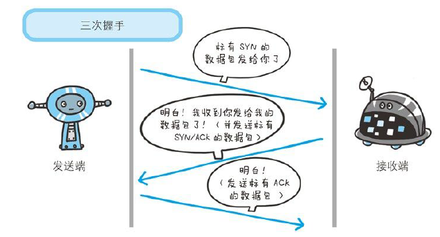
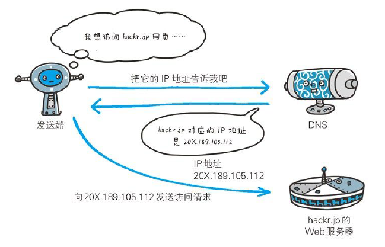
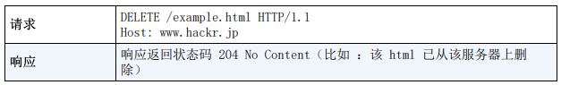
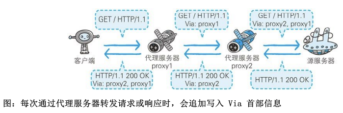
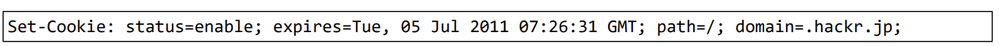

# 图解HTTP笔记

## 第一章 了解Web及网络基础

### 1.2 HTTP的诞生

#### 3项WWW构建技术

- SGML（标准通用标记语言）
- HTML（超文本标记语言）：作为页面的文本标记语言
- HTTP：文档传递协议
- URL（统一资源定位符）：指定文档所在地址

### 1.3 网络基础 TCP/IP

通常使用的网络是在TCP/IP协议族的基础上运作的，HTTP属于它的子集

#### TCP/IP协议族

	

#### TCP/IP的分层管理

TCP/IP分为4层：应用层、传输层、网络层、数据链路层

- 应用层决定了向用户提供应用服务时通信的**活动**（HTTP、FTP）
- 传输层提供处于网络连接中的两台计算机的**数据传输**（TCP、UDP）
- 网络层用来处理网络上流动的**数据包**（IP）
- 链路层用来处理连接网络的硬件部分（设备驱动、网络适配器）

#### TCP/IP通信传输

	

数据每通过一层都会加上该层的首部

	

### 1.4 与HTTP关系密切的协议

#### 负责传输的IP协议

IP地址指明了节点被分配到的地址

MAC地址是网卡所属的固定地址

中转时使用ARP协议 根据MAC地址发送

#### 确保可靠性的TCP协议

- 字节流传输：把大块数据分割成报文段为单位的数据包进行管理

- 确保数据能准确发送：发送后会进行三次握手，确保数据发送成功

  	

### 1.5 负责域名解析的DNS服务

DNS是HTTP一样位于应用层的协议，提供域名到IP地址之间的解析服务，或逆向从IP地址反查域名的服务

xxx.com就是域名，DNS把它转成IP地址

​	

### 1.6 HTTP通信的流程

	

### 1.7 URI和URL

#### 统一资源标识符（URI）

- URI的格式

  	

  登录信息：指定用户名和密码作为从服务器获得资源时的登录信息（可选）

  服务器地址：可以是xxx.com的DNS可解析域名也可以是IP地址

  端口号：指定服务器连接的网络端口号（可选）

  带层次的文件路径：指定服务器上的文件路径来定位资源

  查询字符串：针对指定的资源可以使用查询字符串传入任意参数（可选）

  片段标识符：标记出已经获得资源中的子资源（比如文档的某个位置）（可选）


## 第二章 简单的HTTP协议

### 2.1 HTTP用于客户端和服务器端之间的通信

客户端发送请求，服务器应答，通过HTTP协议能够明确区分两端

### 2.2 通过请求和响应的交换达成通信

下面是一个**客户端的请求报文**

```http
GET /index.htm HTTP/1.1
Host: hackr.jp
Connection: keep-alive
Content-Type: application/x-www-form-urlencoded
Content-Length: 16
name=ueno&age=37
```

GET 表示方法，/index.htm 指明了访问的资源对象，最后的HTTP/1.1 表示HTTP协议的版本号

中间的是请求首部字段、

最下面是内容实体

下面是一个**服务器的响应报文**

```http
HTTP/1.1 200 OK
Date: Tue, 10 Jul 2012 06:50:15 GMT
Content-Length: 362
Content-Type: text/html

<html>
...
```

HTTP/1.1 表示HTTP协议的版本号，200 表示请求处理结果的状态码，OK 是原因短语

中间是首部字段，显示时间和一些内容属性

空行之后是内容的实体

### 2.3 HTTP不保存之前状态

HTTP协议自身不对请求和响应做持久化处理，为了保存状态引入了**Cookie技术**

### 2.4 URI定位资源

多种URI请求方式

- 完整URI

  ```http
  GET http://hackr.jp/index.htm HTTP/1.1
  ```

- 再首部字段Host中写明域名或IP地址

  ```http
  GET /index.htm HTTP/1.1
  Host: hackr.jp
  ```

对服务器自身发送请求

```http
OPTIONS * HTTP/1.1
```

上面表示查询HTTP服务器端支持的HTTP方法种类

### 2.5 告知服务器意图的 HTTP方法

	

GET：获取资源

	

POST：传输实体

	

	

PUT：传输文件

	

HEAD：获取报文首部

HEAD方法和GET方法的区别在于不返回报文的主体部分，用于确认URI的有效性及资源的更新日期时间

DELETE：删除文件

	

OPTIONS：询问支持

	

TRACE：追踪路径

	

CONNECT：要求用隧道协议链接代理

通过代理服务器把通信内容加密后经网络隧道传输

	

### 2.7 持久连接节省通信量

旧版的HTTP协议每次发送HTTP请求时都要断开TCP连接

新版只要任意一端没有明确提出断开连接，则保持TCP连接状态

管线化使得不用等待前一个请求的响应即可发送下一个请求，并行发送

### 2.8 使用Cookie的状态管理

Cookie技术通过在请求和响应报文中写入Cookie信息来控制客户端状态

在报文内加入一个叫Set-Cookie的首部字段信息，通知客户端保存Cookie，下次客户端再发送请求时会自动在请求报文中加入Cookie值后发送

服务器发现客户端发送的Cookie后会对比服务器上的记录，得到之前的状态信息

	

	

	


## 第三章 HTTP报文内的HTTP信息

### 3.1 HTTP报文

HTTP报文结构如下

	

请求报文和响应报文的结构如下


### 3.3 编码 提升传输速率

- **介绍**

  HTTP在传输时可以按照原数据直接传输，也可以通过编码来提升传输速率

  一个报文分为报文首部和报文主体，报文主体是用来传输主体（entity）

  HTTP的**内容编码**是用在实体上的编码格式

  常见的编码格式有

  1. gzip（GNU zip）
  2. compress（UNIX 系统的标准压缩）
  3. deflate（zlib）
  4. identity（不进行编码）

- **分割发送的分块传输编码**

  在HTTP通信中，请求的编码实体资源在尚未传输完成时，页面是无法显示的，所以在传输大容量数据时，一般将编码实体资源进行分块，这样传输过程中可以让浏览器逐步显示页面，这种技术叫**分块传输编码**（Chunked Transfer Coding）

  

  其中每一块都会由一个16进制数来标记块的大小，最后一块会使用“0（CR+LF）”来标记

### 3.4 发送多种数据的 多部分对象集合

HTTP 协议采用了类似**MIME机制**（Multipurpose Internet Mail Extensions，多用途因特网邮件扩展）发送的一份报文可以含有多类型实体

多部分对象集合包含

1. form-data：上传Web表单时使用
2. byteranges：

在HTTP 报文中使用多部分对象集合时，需要在首部字段里加上Content-type 

### 3.5 获取部分内容的 范围请求

为了解决下载过程中的网络中断问题，需要一种可恢复的机制，即从中断处恢复下载

从中断处继续下载，就要像服务器请求从中断处开始的范围内容，即**范围请求**（Range Request），对一份10 000字节大小的资源可以只请求 5001~10 000字节内的资源

	

byte范围的指定形式如下


针对范围请求，响应会返回状态码 206 Partial Content，如果是多重范围请求则会在 Content-Type 标明 multipart/byteranges

### 3.6 内容协商 返回最合适的内容

同一个网站可能存在多份相同内容的页面，比如可能存在一份英文版和中文版的页面，根据浏览器的默认语言来切换，这就是**内容协商机制**

包含在请求报文中的某些**首部字段**就是**判断基准**

- Accept
- Accept-Charset
- Accept-Encoding
- Accept-Language
- Content-Language

内容协商技术有以下3种类型

- **服务器驱动协商**

  由服务器端进行协商，以请求报文的首部字段为参考，在服务器端处理

- **客户端驱动协商**

  用户从浏览器显示的可选项列表中手动选择，还可以利用JS脚本在Web页面上自动进行选择。比如按OS类型自动切换成PC版或手机版页面

- **透明协商**

  服务器驱动协商和客户端驱动协商的结合体，服务器端和客户端各自进行内容协商


## 第四章 返回结果的HTTP状态码

### 4.1 状态码 告知从服务器端返回得请求结果

状态码是服务器端响应时得请求结果

	

状态码类别

	

遵守以上定义，可以**自定义状态码**

### 4.2 2XX 成功状态码

- 200 OK：表示客户端发来得请求在服务器端被正常处理了

- 204 No Content：表示请求已正确处理，但响应报文中不包含实体得主体部分
  

- 206 Partial Content：表示对范围请求的正确处理

  			

### 4.3 3XX 重定向状态码

- 301 Moved Permanently：永久重定向，表示请求的资源已被分配了新的URI

  	

- 302 Found：临时性重定向，表示请求的资源已被分配了新的URI，希望用户能够使用新的URI访问

  	

- 303 See Other：表示由于请求的资源存在着另一个 URI，应使用 GET 方法定向获取请求的资源，与302的区别在于指明采用 GET 方法

  	

- 304 Not Modified：表示当客户端发送附带条件的请求时，服务器允许访问资源，但未满足条件

  	

- 307 Temporary Redirect：临时重定向

### 4.4 4XX 客户端错误状态码

- 400 Bad Request：报文中存在语法错误

- 401 Unauthorized：请求 HTTP 验证

  	

- 403 Forbidden：请求资源的访问被服务器拒绝

- 404 Not Found：服务器上没有请求的资源

### 4.5 5XX 服务器错误状态码

- 500 Internet Server Error：服务器端在执行请求时发生错误
- 503 Service Unavailable：服务器超载或正在停机维护


## 第五章 与 HTTP 协作的 Web 服务器

一台 Web 服务器可搭建多个独立域名的 Web 网站，也可做为中转服务器提升传输效率

### 5.1 用单台虚拟主机实现多个域名

HTTP/1.1 规范允许一台 HTTP 服务器搭建多个 Web 站点，只要使用**虚拟主机**的功能

	

如果一台服务器内托管了多个域名，当收到请求时就需要弄清究竟要访问那个域名，发送 HTTP 请求时，必须在 **Host 首部**内完整指定主机名或域名的 URI

	

### 5.2 通信数据转发程序：代理、网关、隧道

这些应用程序可以将请求**转发**给通信线路上的**下一站服务器**，并且能接收从那台服务器发送的响应再转发给客户端

- **代理**

  代理是一种有转发功能的应用程序，它扮演了位于服务器和客户端之间的“中间人”角色，接收由客户端发送的请求并转发给服务器，同时也接收服务器返回的响应并转发给客户端

  	

  在 HTTP 通信过程中，可级联多台代理服务器，转发时需要附加 Via 首部字段以标记出经过的代理服务器信息

  1. 缓存代理：将资源副本缓存在代理服务器上
  2. 透明代理：不对报文做任何处理加工

- **网关**

  网关是转发其他服务器通信数据的服务器，接收到客户端的请求时，它就像自己拥有资源的源服务器一样对请求进行处理

  网关的机制和代理相似，而网关能使通信线路上的服务器提供非 HTTP 服务

  	

  利用网关可以提高通信的安全性

  

- **隧道**

  隧道是在相隔甚远的客户端和服务器之间进行中转，并保持双方通信连接的应用程序

  隧道的目的是确保客户端与服务器，使用 SSL 等加密手段进行通信，隧道本身不会去解析 HTTP 请求

  

### 5.3 保存资源的缓存

缓存指代理服务器保存的资源副本

	

- 缓存的有效期限

  	

- 客户端的缓存

  客户端也可以有缓存，称为临时网络文件，一样会过期

  	

  


## 第六章 HTTP 首部

### 6.1 HTTP 报文首部

HTTP 报文得结构为

	

报文首部又分为

	

### 6.2 HTTP 首部字段

使用首部字段是为了给浏览器和服务器提供报文主体大小，所使用得语言、认证信息等内容。

- HTTP 首部字段格式

  

- 4 种 HTTP 首部字段类型

  首部字段根据实际用途被分为4类

  - 通用首部字段
  - 请求首部字段
  - 响应首部字段
  - 实体首部字段

- 首部字段一览

  	

  

  

### 6.7 为 Cookie 服务的首部字段


- Set-Cookie

  格式为：

  各字段值：

  

- Cookie

  首部字段 Cookie 会告知服务器，当客户端想获得 HTTP 状态管理支持时，就会在请求中包含从服务器接收到 Cookie。

  

### 6.8 其他首部字段

- X-Frame-Options

  

- X-XSS-Protection

  

- DNT

  

- P3P

  


## 第七章 确保 Web 安全的 HTTPS
