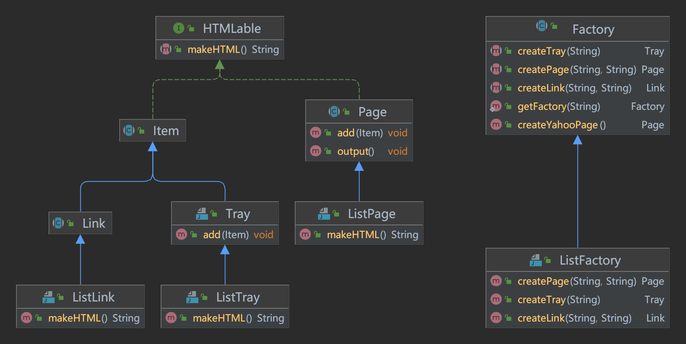

# 设计模式笔记

设计模式指北
--------

面向对象当然也有缺点，比如，最常见的，人与人对世界的认识不同，所以每个人设计的对象结构都不尽相同，于是阅读其他人的代码时，效率就会比较低。长时间面向对象编程之后，一些前辈达人总结出来能够更进一步改善代码结构的方式方法，便是设计模式。

理解和学会设计模式，对我们之后开发会有很大的帮助。

实际上，设计模式离我们并不远。设计模式提出于1990年，距今将近30年，早已渗入各种流行软件的设计当中。以我们 Web 前端为例，除了本文将重点讲述的几个设计模式之外，DOM 事件机制就是观察者模式（Observer）的实现，而 JS 也是基于原型链模式（Prototype）打造的。

如果您使用过现代 MVVM 框架，那么你多半也用过其中的状态管理工具，比如 Vuex。它是从中介者模式（Mediator）演化而来的。

综上所述，其实我们日常开发中已经在享受设计模式带来的便利性和高效率了。

## 适配器模式

### 功能介绍

适配器，其实还有一个不那么文邹邹的翻译：转接头。

如果你有过出国旅行的经验，应该知道，很多国家的插座跟我们不一样，比如香港，采用的是英制的插头，也就是图中这一款。如果你带着自己的设备，想在国外插线充电，就必须用转接头。

事实上适配器模式的工作原理也差不多：比如有个类 A 提供若干个接口，跟我们预期的接口不一致，我们希望对这些接口进行修改，那么有两个方案：

1. 修改类 A，对于浏览器来说几乎不可能
2. 创建类 B，提供新的、符合要求的接口，计算后调用 A 的接口

适配器模式就是后者。

适配器可以方便我们和其它系统进行集成，尤其在新老系统交替的时候，可以达到平滑升级的效果。它也方便我们把程序移植到不同平台，在主程序保持稳定的基础上，我们只要调整适配器里的接口转换代码即可，可以大大提升开发效率、节省维护成本。

### Java实现

```java
package com.ymk.jicheng;

public class Banner {

    private String string;

    public Banner(String string) {
        this.string = string;
    }

    public void showWithParen() {
        System.out.println("(" + string + ")");
    }

    public void showWithAster() {
        System.out.println("*" + string + "*");
    }
}
```

```java
package com.ymk.jicheng;

public interface Print {

    public abstract void printWeak();

    public abstract void printStrong();
}
```

```java
package com.ymk.jicheng;

public class PrintBanner extends Banner implements Print{

    public PrintBanner(String string) {
        super(string);
    }

    @Override
    public void printWeak() {
        showWithParen();
    }

    @Override
    public void printStrong() {
        showWithAster();
    }
}
```

```java
package com.ymk.jicheng;

public class Main {
    public static void main(String[] args) {
        Print p = new PrintBanner("Hello");
        p.printWeak();
        p.printStrong();
    }
}
```

通过新的Banner类，和继承Banner并实现print接口的PrintBanner类，我们让Print实现了满足我们要求的方法，使用了面向对象的多态。

## 单例模式

### 功能介绍

单例模式（Singleton Pattern）是 Java 中最简单的设计模式之一。这种类型的设计模式属于创建型模式，它提供了一种创建对象的最佳方式。

这种模式涉及到一个单一的类，该类负责创建自己的对象，同时确保只有单个对象被创建。这个类提供了一种访问其唯一的对象的方式，可以直接访问，不需要实例化该类的对象。

**注意：**

- 1、单例类只能有一个实例。
- 2、单例类必须自己创建自己的唯一实例。
- 3、单例类必须给所有其他对象提供这一实例。

**意图：**保证一个类仅有一个实例，并提供一个访问它的全局访问点。

**主要解决：**一个全局使用的类频繁地创建与销毁。

**何时使用：**当您想控制实例数目，节省系统资源的时候。

**如何解决：**判断系统是否已经有这个单例，如果有则返回，如果没有则创建。

**关键代码：**构造函数是私有的。

**应用实例：**

- 1、一个班级只有一个班主任。
- 2、Windows 是多进程多线程的，在操作一个文件的时候，就不可避免地出现多个进程或线程同时操作一个文件的现象，所以所有文件的处理必须通过唯一的实例来进行。
- 3、一些设备管理器常常设计为单例模式，比如一个电脑有两台打印机，在输出的时候就要处理不能两台打印机打印同一个文件。

**优点：**

- 1、在内存里只有一个实例，减少了内存的开销，尤其是频繁的创建和销毁实例（比如管理学院首页页面缓存）。
- 2、避免对资源的多重占用（比如写文件操作）。

**缺点：**没有接口，不能继承，与单一职责原则冲突，一个类应该只关心内部逻辑，而不关心外面怎么样来实例化。

### Java实现

```java
package com.ymk;

public class Singleton {

    /**
     * 单实例类
     * 成员和构造函数都是私有的
     * 提供一个公共方法来获取实例
     */
    private static Singleton singleton = new Singleton();

    private Singleton() {
        System.out.println("生成了一个单实例对象");
    }

    public static Singleton getInstance() {
        return singleton;
    }
}
```

```java
package com.ymk;

import com.ymk.zuoye.Triple;
import org.junit.jupiter.api.Test;

public class Main {
    public static void main(String[] args) {
        Singleton instance1 = Singleton.getInstance();
        Singleton instance2 = Singleton.getInstance();

        if (instance1 == instance2) {
            System.out.println("instance1 和 instance2 是同一个对象");
        } else {
            System.out.println("instance1 和 instance2 是不同的对象");
        }
    }
}
```

Singleton类对外提供一个getInstance方法来获取类的实例，实际上获得的都是同一个实例。

## 工厂模式

### 功能介绍

工厂模式（Factory Pattern）是 Java 中最常用的设计模式之一。这种类型的设计模式属于创建型模式，它提供了一种创建对象的最佳方式。

在工厂模式中，我们在创建对象时不会对客户端暴露创建逻辑，并且是通过使用一个共同的接口来指向新创建的对象。

**意图：**定义一个创建对象的接口，让其子类自己决定实例化哪一个工厂类，工厂模式使其创建过程延迟到子类进行。

**主要解决：**主要解决接口选择的问题。

**何时使用：**我们明确地计划不同条件下创建不同实例时。

**如何解决：**让其子类实现工厂接口，返回的也是一个抽象的产品。

**关键代码：**创建过程在其子类执行。

**应用实例：** 1、您需要一辆汽车，可以直接从工厂里面提货，而不用去管这辆汽车是怎么做出来的，以及这个汽车里面的具体实现。 2、Hibernate 换数据库只需换方言和驱动就可以。

**优点：** 1、一个调用者想创建一个对象，只要知道其名称就可以了。 2、扩展性高，如果想增加一个产品，只要扩展一个工厂类就可以。 3、屏蔽产品的具体实现，调用者只关心产品的接口。

**缺点：**每次增加一个产品时，都需要增加一个具体类和对象实现工厂，使得系统中类的个数成倍增加，在一定程度上增加了系统的复杂度，同时也增加了系统具体类的依赖。这并不是什么好事。

### Java实现

```java
package com.ymk.framework;

public abstract class Product {

    public abstract void use();
}
```

```java
package com.ymk.framework;

public abstract class Factory {

    public final Product create(String owner) {
        Product p = createProduct(owner);
        registerProduct(p);
        return p;
    }

    protected abstract Product createProduct(String owner);

    protected abstract void registerProduct(Product product);
}
```

```java
package com.ymk.idcard;

import com.ymk.framework.Product;

public class IDCard extends Product {

    private Integer id;

    private String owner;

    IDCard(String owner, Integer id) {
        this.owner = owner;
        this.id = id;
        System.out.println("制作" + owner + "的 ID 卡，编号为 " + id);
    }

    @Override
    public void use() {
        System.out.println("使用" + owner + "的 ID 卡，编号为 " + id);
    }

    public Integer getId() {
        return id;
    }

    public String getOwner() {
        return owner;
    }
}
```

```java
package com.ymk.idcard;

import com.ymk.framework.Factory;
import com.ymk.framework.Product;

import java.util.HashMap;
import java.util.Map;

public class IDCardFactory extends Factory {

    private Map<Integer, String> owners = new HashMap<>();
    private static Integer id = 0;

    @Override
    protected Product createProduct(String owner) {
        return new IDCard(owner, id++);
    }

    @Override
    protected void registerProduct(Product product) {
        owners.put(((IDCard) product).getId(), ((IDCard) product).getOwner());
    }

    public Map<Integer, String> getOwners() {
        return owners;
    }
}
```

```java
package com.ymk;

import com.ymk.framework.Factory;
import com.ymk.framework.Product;
import com.ymk.idcard.IDCardFactory;
import org.junit.jupiter.api.Test;

public class Main {

    @Test
    public void testIdCard() {
        Factory factory = new IDCardFactory();

        Product card1 = factory.create("ymk");
        Product card2 = factory.create("cfh");
        Product card3 = factory.create("tyh");

        card1.use();
        card2.use();
        card3.use();
    }


}
```

## 模板模式

### 功能介绍

在模板模式（Template Pattern）中，一个抽象类公开定义了执行它的方法的方式/模板。它的子类可以按需要重写方法实现，但调用将以抽象类中定义的方式进行。这种类型的设计模式属于行为型模式。

**意图：**定义一个操作中的算法的骨架，而将一些步骤延迟到子类中。模板方法使得子类可以不改变一个算法的结构即可重定义该算法的某些特定步骤。

**主要解决：**一些方法通用，却在每一个子类都重新写了这一方法。

**何时使用：**有一些通用的方法。

**如何解决：**将这些通用算法抽象出来。

**关键代码：**在抽象类实现，其他步骤在子类实现。

**应用实例：** 1、在造房子的时候，地基、走线、水管都一样，只有在建筑的后期才有加壁橱加栅栏等差异。 2、西游记里面菩萨定好的 81 难，这就是一个顶层的逻辑骨架。 3、spring 中对 Hibernate 的支持，将一些已经定好的方法封装起来，比如开启事务、获取 Session、关闭 Session 等，程序员不重复写那些已经规范好的代码，直接丢一个实体就可以保存。

**优点：** 1、封装不变部分，扩展可变部分。 2、提取公共代码，便于维护。 3、行为由父类控制，子类实现。

**缺点：**每一个不同的实现都需要一个子类来实现，导致类的个数增加，使得系统更加庞大。

### Java实现

上一节的工厂抽象类实际上用的就是模板模式，定义了对外的create方法，它的子类需要实现其他基础方法。

```java
package com.ymk;

public abstract class AbstractDisplay {

    /**
     * 下面3个抽象的方法交给子类去实现
     */
    public abstract void open();

    public abstract void print();

    public abstract void close();

    /**
     * 实体方法
     */
    public final void display() {
        open();
        for (int i = 0; i < 5; i++) {
            print();
        }
        close();
    }
}
```

```java
package com.ymk;

public class CharDisplay extends AbstractDisplay{

    private char ch;

    public CharDisplay(char ch) {
        this.ch = ch;
    }

    @Override
    public void open() {
        System.out.print("<<");
    }

    @Override
    public void print() {
        System.out.print(ch);
    }

    @Override
    public void close() {
        System.out.println(">>");
    }
}
```

```java
package com.ymk;

public class StringDisplay extends AbstractDisplay{

    private String str;

    private int width;

    public StringDisplay(String str) {
        this.str = str;
        this.width = str.getBytes().length;
    }

    @Override
    public void open() {
        printLine();
    }

    @Override
    public void print() {
        System.out.println("|" + str + "|");
    }

    @Override
    public void close() {
        printLine();
    }

    private void printLine() {
        System.out.print("+");
        for (int i = 0; i < width; i++) {
            System.out.print("-");
        }
        System.out.println("+");
    }
}
```

```java
package com.ymk;

public class Main {
    public static void main(String[] args) {
        AbstractDisplay charDis = new CharDisplay('y');
        charDis.display();

        AbstractDisplay strDis = new StringDisplay("ymk");
        strDis.display();
    }
}
```

## 建造者模式

### 功能介绍

建造者模式（Builder Pattern）使用多个简单的对象一步一步构建成一个复杂的对象。这种类型的设计模式属于创建型模式，它提供了一种创建对象的最佳方式。

一个 Builder 类会一步一步构造最终的对象。该 Builder 类是独立于其他对象的。

**意图：**将一个复杂的构建与其表示相分离，使得同样的构建过程可以创建不同的表示。

**主要解决：**主要解决在软件系统中，有时候面临着"一个复杂对象"的创建工作，其通常由各个部分的子对象用一定的算法构成；由于需求的变化，这个复杂对象的各个部分经常面临着剧烈的变化，但是将它们组合在一起的算法却相对稳定。

**何时使用：**一些基本部件不会变，而其组合经常变化的时候。

**如何解决：**将变与不变分离开。

**关键代码：**建造者：创建和提供实例，导演：管理建造出来的实例的依赖关系。

**应用实例：** 1、去肯德基，汉堡、可乐、薯条、炸鸡翅等是不变的，而其组合是经常变化的，生成出所谓的"套餐"。 2、JAVA 中的 StringBuilder。

**优点：** 1、建造者独立，易扩展。 2、便于控制细节风险。

**缺点：** 1、产品必须有共同点，范围有限制。 2、如内部变化复杂，会有很多的建造类。

**使用场景：** 1、需要生成的对象具有复杂的内部结构。 2、需要生成的对象内部属性本身相互依赖。

**注意事项：**与工厂模式的区别是：建造者模式更加关注与零件装配的顺序。

### Java实现

```java
package com.ymk.example;

public interface Builder {

    public void makeTitle(String title);

    public void makeString(String str);

    public void makeItems(String[] items);

    public void close();
}
```

```java
package com.ymk.example;

public class HtmlBuilder implements Builder{
    @Override
    public void makeTitle(String title) {

    }

    @Override
    public void makeString(String str) {

    }

    @Override
    public void makeItems(String[] items) {

    }

    @Override
    public void close() {

    }
}
```

```java
package com.ymk.example;

public class TextBuilder implements Builder{

    private StringBuffer buffer = new StringBuffer();   // 保存文档内容

    @Override
    public void makeTitle(String title) {
        buffer.append("=========================================================\n");
        buffer.append("[" + title + "]\n");
        buffer.append("\n");
    }

    @Override
    public void makeString(String str) {
        buffer.append('@' + str + "\n");
        buffer.append("\n");
    }

    @Override
    public void makeItems(String[] items) {
        for (String item : items) {
            buffer.append(" ^" + item + "\n");
        }
        buffer.append("\n");
    }

    @Override
    public void close() {
        buffer.append("=========================================================\n");
        buffer.append("\n");
    }

    public StringBuffer getBuffer() {
        return buffer;
    }
}
```

```java
package com.ymk.example;

public class Director {

    private Builder builder;

    public Director(Builder builder) {
        this.builder = builder;
    }

    public void construct() {
        builder.makeTitle("Greetings");
        builder.makeString("从早上至下午");
        builder.makeItems(new String[]{"早上好", "下午好", "晚上好"});
        builder.close();
    }
}
```

```java
package com.ymk.example;

public class Main {
    public static void main(String[] args) {
        TextBuilder textBuilder = new TextBuilder();
        Director director = new Director(textBuilder);
        director.construct();
        System.out.println(textBuilder.getBuffer());
    }
}
```

Director类独立于Builder类和它的两个实现，Builder类定义了这一类型的固定方法，它的实现类需要将这些方法实现，所以Builder的两个实现类，TextBuilder和HtmlBuilder都可以被Director类调用。

## 抽象工厂模式

### 功能介绍

抽象工厂模式（Abstract Factory Pattern）是围绕一个超级工厂创建其他工厂。该超级工厂又称为其他**工厂的工厂**。这种类型的设计模式属于创建型模式，它提供了一种创建对象的最佳方式。

在抽象工厂模式中，接口是负责创建一个相关对象的工厂，不需要显式指定它们的类。每个生成的工厂都能按照工厂模式提供对象。

### Java实现



```java
package com.ymk.example.factory;

public interface HTMLable {
    public String makeHTML();
}
```

```java
package com.ymk.example.factory;

public abstract class Item implements HTMLable{

    protected String caption;

    public Item(String caption) {
        this.caption = caption;
    }
}
```

```java
package com.ymk.example.factory;

public abstract class Link extends Item{

    protected String url;

    public Link(String caption, String url) {
        super(caption);
        this.url = url;
    }
}
```

```java
package com.ymk.example.factory;

import java.util.ArrayList;

public abstract class Tray extends Item{

    protected ArrayList tray = new ArrayList<>();

    public Tray(String caption) {
        super(caption);
    }

    public void add(Item item) {
        tray.add(item);
    }
}
```

```java
package com.ymk.example.factory;

import java.io.FileWriter;
import java.io.IOException;
import java.util.ArrayList;

public abstract class Page implements HTMLable{

    protected String title;

    protected String author;

    protected ArrayList content = new ArrayList<>();

    public Page(String title, String author) {
        this.title = title;
        this.author = author;
    }

    public void add(Item item) {
        content.add(item);
    }

    public void output() {
        try {
            String fileName = title + ".html";
            FileWriter writer = new FileWriter(fileName);
            writer.write(this.makeHTML());
            writer.close();
            System.out.println(fileName + " 编写完成！");
        } catch (IOException e) {
            e.printStackTrace();
        }
    }
}
```

```java
package com.ymk.example.factory;

public abstract class Factory {

    public static Factory getFactory(String className) {
        Factory factory = null;
        try {
            factory = (Factory) Class.forName(className).newInstance();
        } catch (ClassNotFoundException e) {
            System.err.println("没有找到 " + className + " 类！");
        } catch (Exception e) {
            e.printStackTrace();
        }
        return factory;
    }

    public Page createYahooPage() {
        Link us_yahoo = this.createLink("Yahoo!", "https://www.yahoo.com/");
        Link jp_yahoo = this.createLink("Yahoo!Japan", "https://www.yahoo.co.jp/");
        Tray trayYahoo = this.createTray("Yahoo");
        trayYahoo.add(us_yahoo);
        trayYahoo.add(jp_yahoo);
        Page page = this.createPage("Yahoo", "Yahoo");
        page.add(trayYahoo);
        return page;
    }

    public abstract Link createLink(String caption, String url);

    public abstract Tray createTray(String caption);

    public abstract Page createPage(String title, String author);
}
```

```java
package com.ymk.example.listfactory;

import com.ymk.example.factory.Link;

public class ListLink extends Link {
    public ListLink(String caption, String url) {
        super(caption, url);
    }

    @Override
    public String makeHTML() {
        return "  <li><a href=\"" + url + "\">" + caption + "</a></li>\n";
    }
}
```

```java
package com.ymk.example.listfactory;

import com.ymk.example.factory.Item;
import com.ymk.example.factory.Tray;

import java.util.Iterator;


public class ListTray extends Tray {
    public ListTray(String caption) {
        super(caption);
    }

    @Override
    public String makeHTML() {
        StringBuffer buffer = new StringBuffer();
        buffer.append("<li>\n");
        buffer.append(caption + "\n");
        buffer.append("<ul>\n");
        Iterator it = tray.iterator();
        while (it.hasNext()) {
            Item item = (Item) it.next();
            buffer.append(item.makeHTML());
        }
        buffer.append("</ul>\n");
        buffer.append("</li\n");
        return buffer.toString();
    }
}
```

```java
package com.ymk.example.listfactory;

import com.ymk.example.factory.Item;
import com.ymk.example.factory.Page;

import java.util.Iterator;

public class ListPage extends Page {
    public ListPage(String title, String author) {
        super(title, author);
    }

    @Override
    public String makeHTML() {
        StringBuffer buffer = new StringBuffer();
        buffer.append("<html><head><title>" + title + "</title></head>\n");
        buffer.append("<body>\n");
        buffer.append("<h1>" + title + "</h1>\n");
        buffer.append("<ul>\n");
        Iterator it = content.iterator();
        while (it.hasNext()) {
            Item item = (Item) it.next();
            buffer.append(item.makeHTML());
        }
        buffer.append("</ul>\n");
        buffer.append("<hr><address>" + author + "</address>");
        buffer.append("</body></html>\n");
        return buffer.toString();
    }
}
```

```java
package com.ymk.example.listfactory;

import com.ymk.example.factory.Factory;
import com.ymk.example.factory.Link;
import com.ymk.example.factory.Page;
import com.ymk.example.factory.Tray;

public class ListFactory {
    @Override
    public Link createLink(String caption, String url) {
        return new ListLink(caption, url);
    }

    @Override
    public Tray createTray(String caption) {
        return new ListTray(caption);
    }

    @Override
    public Page createPage(String title, String author) {
        return new ListPage(title, author);
    }
}
```

```java
package com.ymk.example;

import com.ymk.example.factory.Factory;
import com.ymk.example.factory.Link;
import com.ymk.example.factory.Page;
import com.ymk.example.factory.Tray;

public class Main {

    public static void main(String[] args) {

        Factory factory = Factory.getFactory("com.ymk.example.listfactory.ListFactory");

//        Link people = factory.createLink("人民日报", "https://www.people.com.cn/");
//        Link gmw = factory.createLink("光明日报", "https://www.gmw.com.cn/");
//        Link us_yahoo = factory.createLink("Yahoo!", "https://www.yahoo.com/");
//        Link jp_yahoo = factory.createLink("Yahoo!Japan", "https://www.yahoo.co.jp/");
//        Link excite = factory.createLink("Excite", "https://www.excite.com/");
//        Link google = factory.createLink("Google", "https://www.google.com/");
//
//        Tray trayNews = factory.createTray("日报");
//        trayNews.add(people);
//        trayNews.add(gmw);
//
//        Tray trayYahoo = factory.createTray("Yahoo");
//        trayYahoo.add(us_yahoo);
//        trayYahoo.add(jp_yahoo);
//
//        Tray traySearch = factory.createTray("搜索引擎");
//        traySearch.add(excite);
//        traySearch.add(google);
//
//        Page page = factory.createPage("LinkPage", "ymk");
//        page.add(trayNews);
//        page.add(trayYahoo);
//        page.add(traySearch);

        Page page = factory.createYahooPage();

        page.output();
    }
}
```

## 桥接模式

### 功能介绍

桥接（Bridge）是用于把抽象化与实现化解耦，使得二者可以独立变化。这种类型的设计模式属于结构型模式，它通过提供抽象化和实现化之间的桥接结构，来实现二者的解耦。

这种模式涉及到一个作为桥接的接口，使得实体类的功能独立于接口实现类。这两种类型的类可被结构化改变而互不影响。

我们通过下面的实例来演示桥接模式（Bridge Pattern）的用法。其中，可以使用相同的抽象类方法但是不同的桥接实现类，来画出不同颜色的圆。

**意图：**将抽象部分与实现部分分离，使它们都可以独立的变化。

**主要解决：**在有多种可能会变化的情况下，用继承会造成类爆炸问题，扩展起来不灵活。

**何时使用：**实现系统可能有多个角度分类，每一种角度都可能变化。

**如何解决：**把这种多角度分类分离出来，让它们独立变化，减少它们之间耦合。

**关键代码：**抽象类依赖实现类。

**应用实例：** 墙上的开关，可以看到的开关是抽象的，不用管里面具体怎么实现的。

**优点：** 1、抽象和实现的分离。 2、优秀的扩展能力。 3、实现细节对客户透明。

**缺点：**桥接模式的引入会增加系统的理解与设计难度，由于聚合关联关系建立在抽象层，要求开发者针对抽象进行设计与编程。

**使用场景：** 1、如果一个系统需要在构件的抽象化角色和具体化角色之间增加更多的灵活性，避免在两个层次之间建立静态的继承联系，通过桥接模式可以使它们在抽象层建立一个关联关系。 2、对于那些不希望使用继承或因为多层次继承导致系统类的个数急剧增加的系统，桥接模式尤为适用。 3、一个类存在两个独立变化的维度，且这两个维度都需要进行扩展。

**注意事项：**对于两个独立变化的维度，使用桥接模式再适合不过了。

### Java实现


```java
package com.ymk.example;

public interface DisplayImpl {

    public void rawOpen();

    public void rawPrint();

    public void rawClose();
}
```

```java
package com.ymk.example;

public class StringDisplayImpl implements DisplayImpl{

    private String string;

    private int width;

    public StringDisplayImpl(String string) {
        this.string = string;
        this.width = string.getBytes().length;
    }

    @Override
    public void rawOpen() {
        printLine();
    }

    @Override
    public void rawPrint() {
        System.out.println("|" + string + "|");
    }

    @Override
    public void rawClose() {
        printLine();
    }

    private void printLine() {
        System.out.print("+");
        for (int i = 0; i < width; i++) {
            System.out.print("-");
        }
        System.out.println("+");
    }
}
```

```java
package com.ymk.example;

import java.io.*;

public class TxtDisplayImpl implements DisplayImpl{

    private String pathName;

    private BufferedReader bufferedReader = null;

    public TxtDisplayImpl(String pathName) {
        this.pathName = pathName;
    }

    @Override
    public void rawOpen() {
        try {
            this.bufferedReader = new BufferedReader(new FileReader(pathName));
            bufferedReader.mark(4096);
        } catch (IOException e) {
            e.printStackTrace();
        }
        System.out.println("打开 TXT 文件");
    }

    @Override
    public void rawPrint() {
        String dataLine;
        try {
            bufferedReader.reset();
            while (((dataLine = bufferedReader.readLine()) != null)) {
                System.out.println("> " + dataLine);
            }

        } catch (IOException e) {
            e.printStackTrace();
        }
    }

    @Override
    public void rawClose() {
        if (bufferedReader != null) {
            try {
                bufferedReader.close();
            } catch (IOException e) {
                e.printStackTrace();
            }
        }
        System.out.println("关闭 TXT 文件");
    }
}
```

```java
package com.ymk.example;

public class Display {

    private DisplayImpl impl;

    public Display(DisplayImpl impl) {
        this.impl = impl;
    }

    public void open() {
        impl.rawOpen();
    }

    public void print() {
        impl.rawPrint();
    }

    public void close() {
        impl.rawClose();
    }

    public final void display() {
        open();
        print();
        close();
    }
}
```

```java
package com.ymk.example;

import java.util.Random;

public class RandomDisplay extends Display{
    
    public RandomDisplay(DisplayImpl impl) {
        super(impl);
    }

    /**
     * 随机打印20次以内
     */
    public void randomDisplay(int times) {
        Random r = new Random();
        int i1 = r.nextInt(times); // 生成[0,10]区间的整数
        open();
        for (int i = 0; i < i1; i++) {
            print();
        }
        close();
    }
}
```

```java
package com.ymk.example;

public class CountDisplay extends Display{

    public CountDisplay(DisplayImpl impl) {
        super(impl);
    }

    /**
     * 多次显示
     * @param times
     */
    public void multiDisplay(int times) {
        open();
        for (int i = 0; i < times; i++) {
            print();
        }
        close();
    }
}
```

DisplayImpl的实现类StringDisplayImpl和TxtDisplayImpl是用来显示不同类型，Display的子类CountDisplay和RandomDisplay用来实现不同的显示效果。

## 原型模式

### 功能介绍

原型模式（Prototype Pattern）是用于**创建重复的对象**，同时又能保证性能。这种类型的设计模式属于创建型模式，它提供了一种创建对象的最佳方式之一。

这种模式是实现了一个原型接口，该接口用于创建当前对象的克隆。当直接创建对象的代价比较大时，则采用这种模式。例如，一个对象需要在一个高代价的数据库操作之后被创建。我们可以缓存该对象，在下一个请求时返回它的克隆，在需要的时候更新数据库，以此来减少数据库调用。

**意图：**用原型实例指定创建对象的种类，并且通过拷贝这些原型创建新的对象。

**主要解决：**在运行期建立和删除原型。

**何时使用：** 1、当一个系统应该独立于它的产品创建，构成和表示时。 2、当要实例化的类是在运行时刻指定时，例如，通过动态装载。 3、为了避免创建一个与产品类层次平行的工厂类层次时。 4、当一个类的实例只能有几个不同状态组合中的一种时。建立相应数目的原型并克隆它们可能比每次用合适的状态手工实例化该类更方便一些。

**如何解决：**利用已有的一个原型对象，快速地生成和原型对象一样的实例。

**关键代码：** 1、实现克隆操作，在 JAVA 实现 Cloneable 接口，重写 clone()，在 .NET 中可以使用 Object 类的 MemberwiseClone() 方法来实现对象的浅拷贝或通过序列化的方式来实现深拷贝。 2、原型模式同样用于隔离类对象的使用者和具体类型（易变类）之间的耦合关系，它同样要求这些"易变类"拥有稳定的接口。

**应用实例：** 1、细胞分裂。 2、JAVA 中的 Object clone() 方法。

**优点：** 1、性能提高。 2、逃避构造函数的约束。

**缺点：** 1、配备克隆方法需要对类的功能进行通盘考虑，这对于全新的类不是很难，但对于已有的类不一定很容易，特别当一个类引用不支持串行化的间接对象，或者引用含有循环结构的时候。 2、必须实现 Cloneable 接口。

**使用场景：** 1、资源优化场景。 2、类初始化需要消化非常多的资源，这个资源包括数据、硬件资源等。 3、性能和安全要求的场景。 4、通过 new 产生一个对象需要非常繁琐的数据准备或访问权限，则可以使用原型模式。 5、一个对象多个修改者的场景。 6、一个对象需要提供给其他对象访问，而且各个调用者可能都需要修改其值时，可以考虑使用原型模式拷贝多个对象供调用者使用。 7、在实际项目中，原型模式很少单独出现，一般是和工厂方法模式一起出现，通过 clone 的方法创建一个对象，然后由工厂方法提供给调用者。原型模式已经与 Java 融为浑然一体，大家可以随手拿来使用。

**注意事项：**与通过对一个类进行实例化来构造新对象不同的是，原型模式是通过拷贝一个现有对象生成新对象的。浅拷贝实现 Cloneable，重写，深拷贝是通过实现 Serializable 读取二进制流。

### Java实现

```java
package com.ymk.example.framework;

public abstract class Product implements Cloneable{

    public abstract void use(String str);

    public Product createClone() {
        Product p = null;
        try {
            p = (Product) clone();
        } catch (CloneNotSupportedException e) {
            e.printStackTrace();
        }
        return p;
    }
}
```

```java
package com.ymk.example.framework;

import java.util.HashMap;

public class Manager {

    private HashMap showcase = new HashMap();

    public void register(String name, Product proto) {
        showcase.put(name, proto);
    }

    public Product create(String protoName) {
        Product p = (Product) showcase.get(protoName);
        return p.createClone();
    }
}
```

```java
package com.ymk.example.proto;

import com.ymk.example.framework.Product;

public class MessageBox extends Product {

    private char decoChar;

    public MessageBox(char decoChar) {
        this.decoChar = decoChar;
    }

    @Override
    public void use(String str) {
        int length = str.getBytes().length;
        printDecoChar(length);
        System.out.println();
        System.out.println(decoChar + " " + str + " " + decoChar);
        printDecoChar(length);
        System.out.println();
    }

    private void printDecoChar(int length) {
        for (int i = 0; i < length + 4; i++) {
            System.out.print(decoChar);
        }
    }
}
```

```java
package com.ymk.example.proto;

import com.ymk.example.framework.Product;

public class UnderlinePen extends Product {
    @Override
    public void use(String str) {

    }
}
```

```java
package com.ymk.example;

import com.ymk.example.framework.Manager;
import com.ymk.example.framework.Product;
import com.ymk.example.proto.MessageBox;
import org.junit.jupiter.api.Test;

public class MyTest {

    @Test
    public void testMsgBox() {
        MessageBox messageBox1 = new MessageBox('&');
        MessageBox messageBox2 = new MessageBox('*');

        Manager manager = new Manager();
        manager.register("Information Message", messageBox1);
        manager.register("Warning Message", messageBox2);

        Product clone = manager.create("Warning Message");
        clone.use("clone");
    }
}
```